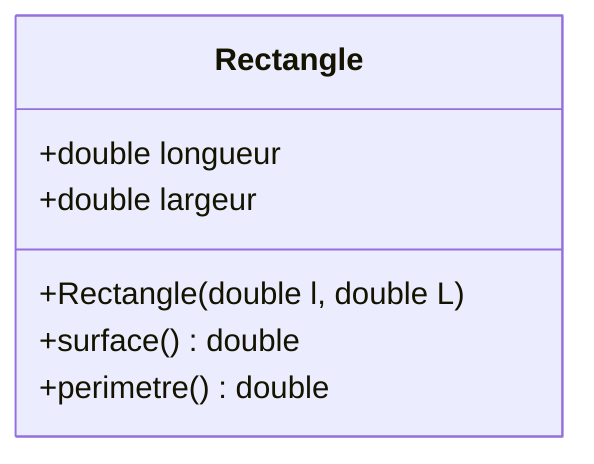

# **TP – Programmation Orientée Objet : Rectangle & Carré**

[](https://www.cpp.org/)
[](https://www.vscode.fr/)

## Sommaire

* Partie 0 : notion de classe + constructeur + méthodes
	- `Classe Rectangle simple`
* Partie 1 : héritage simple
	- `Ajout de l'héritage (Carre)`

---

## **Partie 0 – Création de la classe `Rectangle`**

Dans cette partie, on introduit une classe simple : **Rectangle**.
L’objectif est de comprendre :

* la déclaration d’une classe
* l’utilisation d’attributs
* le rôle du constructeur
* les méthodes membres (surface, périmètre)

### **Code C++**

```cpp
#include <iostream> // Pour l'affichage console

/*
 * Classe Rectangle : représente un rectangle avec une longueur et une largeur
 */
class Rectangle {
public:
    double longueur; // Longueur du rectangle
    double largeur;  // Largeur du rectangle

    // Constructeur avec contrôle basique : initialise les dimensions
    Rectangle(double l = 0, double L = 0) : longueur(l), largeur(L) {
        if (l < 0 || L < 0) {
            std::cerr << "Erreur : dimensions négatives !" << std::endl;
            longueur = largeur = 0;
        }
    }

    // Calcule la surface du rectangle
    double surface() const { return longueur * largeur; }

    // Calcule le périmètre du rectangle
    double perimetre() const { return 2 * (longueur + largeur); }
};

int main() {
    // Création d’un rectangle de 3x4
    Rectangle rect(3, 4);

    // Affichage des valeurs
    std::cout << "Longueur : " << rect.longueur << std::endl;
    std::cout << "Largeur  : " << rect.largeur  << std::endl;

    std::cout << "Surface  : " << rect.surface() << std::endl;
    std::cout << "Périmètre : " << rect.perimetre() << std::endl;

    return 0;
}
```

---

### **Diagramme UML**



---
---

## **Partie 1 – Ajout de l'héritage : classe `Carre`**

Un carré est un cas particulier de rectangle : **ses 4 côtés sont égaux**.

On utilise donc **l’héritage** pour créer une classe `Carre` dérivant de `Rectangle`.

### **Code C++**

```cpp
#include <iostream> // Inclusion de la bibliothèque pour l'affichage console
#include <cmath>    // Inclusion pour les fonctions mathématiques (pow ici)

/*
 * Classe Rectangle : représente un rectangle avec longueur et largeur
 */
class Rectangle {
public:
    double longueur; // Longueur du rectangle
    double largeur;  // Largeur du rectangle

    // Constructeur : initialise la longueur et la largeur
    // Rectangle(double l, double L) : longueur(l), largeur(L) {}

    // OU

    // Constructeur avec valeurs par défaut et vérification
    Rectangle(double l = 0, double L = 0) : longueur(l), largeur(L) {
        // Assure que les dimensions ne sont pas négatives
        if (l < 0 || L < 0) {
            std::cerr << "Erreur : dimension négative !" << std::endl;
            longueur = largeur = 0;
        }
    }

    // Calcule la surface du rectangle
    double surface() const { return longueur * largeur; }

    // Calcule le périmètre du rectangle
    double perimetre() const { return 2 * (longueur + largeur); }
};

/*
 * Classe Carre : représente un carré, hérite de Rectangle
 */
class Carre : public Rectangle {
public:
    // Constructeur : initialise le carré avec un côté (longueur = largeur)
    // Carre(double cote) : Rectangle(cote, cote) {}
    // OU
    Carre(double cote = 0) : Rectangle(cote, cote) {}

    // Calcule la surface du carré (côté * côté)
    double surface() const { return pow(longueur, 2); }

    // Calcule le périmètre (4 fois le côté)
    double perimetre() const { return 4 * longueur; }
};

// OU en s'appuyant sur les méthodes de Rectangle
// class Carre : public Rectangle {
// public:
//     Carre(double cote = 0) : Rectangle(cote, cote) {}
// };


/*
 * Fonction principale : point d'entrée du programme
 */
int main() {
    // Création d'un rectangle avec longueur=3 et largeur=4
    Rectangle rect(3, 4);

    // Affichage de la surface et du périmètre du rectangle
    std::cout << "Surface rectangle : " << rect.surface() << std::endl;
    std::cout << "Périmètre rectangle : " << rect.perimetre() << std::endl;

    // Création d'un carré de côté 5
    Carre carre(5);

    // Affichage de la surface et du périmètre du carré
    std::cout << "Surface carré : " << carre.surface() << std::endl;
    std::cout << "Périmètre carré : " << carre.perimetre() << std::endl;

    return 0; // Fin du programme
}
```

---
