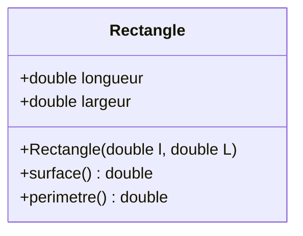
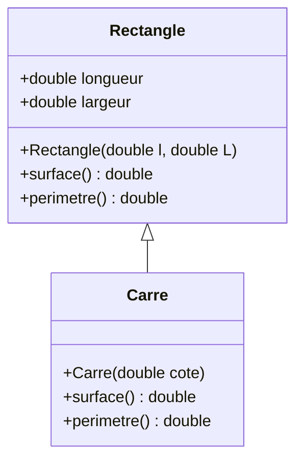
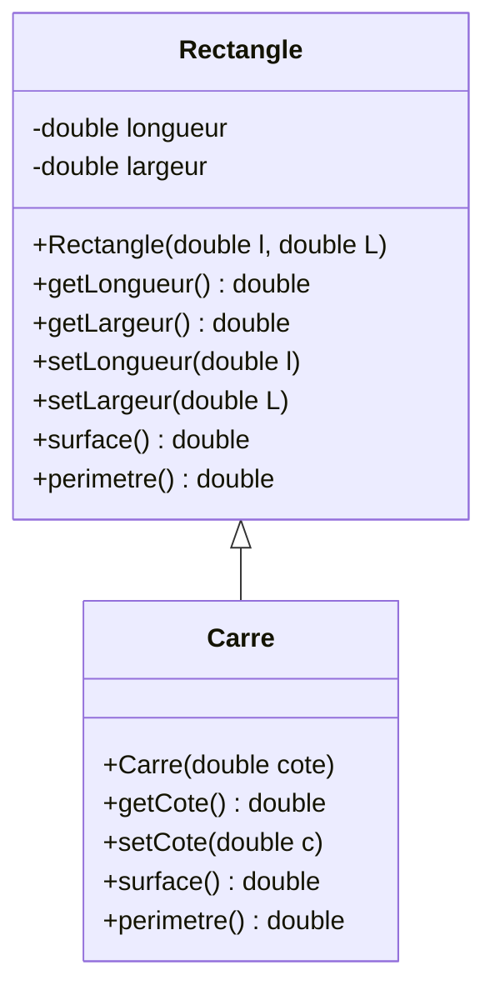

# **TP – Programmation Orientée Objet : Rectangle & Carré**

[](https://www.cpp.org/)
[](https://www.vscode.fr/)

## Sommaire

* Partie 0 : notion de classe + constructeur + méthodes
	- `Classe Rectangle simple`
* Partie 1 : héritage simple
	- `Ajout de l'héritage (Carre)`
* Partie 2 : encapsulation et bonnes pratiques
	- `Ajout des getters/setters et encapsulation`

---

## **Partie 0 – Création de la classe `Rectangle`**

Dans cette partie, on introduit une classe simple : **Rectangle**.
L’objectif est de comprendre :

* la déclaration d’une classe
* l’utilisation d’attributs
* le rôle du constructeur
* les méthodes membres (surface, périmètre)

### **Code C++**

```cpp
#include <iostream> // Pour l'affichage console

/*
 * Classe Rectangle : représente un rectangle avec une longueur et une largeur
 */
class Rectangle {
public:
    double longueur; // Longueur du rectangle
    double largeur;  // Largeur du rectangle

    // Constructeur avec contrôle basique : initialise les dimensions
    Rectangle(double l = 0, double L = 0) : longueur(l), largeur(L) {
        if (l < 0 || L < 0) {
            std::cerr << "Erreur : dimensions négatives !" << std::endl;
            longueur = largeur = 0;
        }
    }

    // Calcule la surface du rectangle
    double surface() const { return longueur * largeur; }

    // Calcule le périmètre du rectangle
    double perimetre() const { return 2 * (longueur + largeur); }
};

int main() {
    // Création d’un rectangle de 3x4
    Rectangle rect(3, 4);

    // Affichage des valeurs
    std::cout << "Longueur : " << rect.longueur << std::endl;
    std::cout << "Largeur  : " << rect.largeur  << std::endl;

    std::cout << "Surface  : " << rect.surface() << std::endl;
    std::cout << "Périmètre : " << rect.perimetre() << std::endl;

    return 0;
}
```

---

### **Diagramme UML**



---


## **Partie 1 – Ajout de l'héritage : classe `Carre`**

Un carré est un cas particulier de rectangle : **ses 4 côtés sont égaux**.

On utilise donc **l’héritage** pour créer une classe `Carre` dérivant de `Rectangle`.

### **Code C++**

```cpp
#include <iostream> // Inclusion de la bibliothèque pour l'affichage console
#include <cmath>    // Inclusion pour les fonctions mathématiques (pow ici)

/*
 * Classe Rectangle : représente un rectangle avec longueur et largeur
 */
class Rectangle {
public:
    double longueur; // Longueur du rectangle
    double largeur;  // Largeur du rectangle

    // Constructeur : initialise la longueur et la largeur
    // Rectangle(double l, double L) : longueur(l), largeur(L) {}

    // OU

    // Constructeur avec valeurs par défaut et vérification
    Rectangle(double l = 0, double L = 0) : longueur(l), largeur(L) {
        // Assure que les dimensions ne sont pas négatives
        if (l < 0 || L < 0) {
            std::cerr << "Erreur : dimension négative !" << std::endl;
            longueur = largeur = 0;
        }
    }

    // Calcule la surface du rectangle
    double surface() const { return longueur * largeur; }

    // Calcule le périmètre du rectangle
    double perimetre() const { return 2 * (longueur + largeur); }
};

/*
 * Classe Carre : représente un carré, hérite de Rectangle
 */
class Carre : public Rectangle {
public:
    // Constructeur : initialise le carré avec un côté (longueur = largeur)
    // Carre(double cote) : Rectangle(cote, cote) {}
    // OU
    Carre(double cote = 0) : Rectangle(cote, cote) {}

    // Calcule la surface du carré (côté * côté)
    double surface() const { return pow(longueur, 2); }

    // Calcule le périmètre (4 fois le côté)
    double perimetre() const { return 4 * longueur; }
};

// OU en s'appuyant sur les méthodes de Rectangle
// class Carre : public Rectangle {
// public:
//     Carre(double cote = 0) : Rectangle(cote, cote) {}
// };


/*
 * Fonction principale : point d'entrée du programme
 */
int main() {
    // Création d'un rectangle avec longueur=3 et largeur=4
    Rectangle rect(3, 4);

    // Affichage de la surface et du périmètre du rectangle
    std::cout << "Surface rectangle : " << rect.surface() << std::endl;
    std::cout << "Périmètre rectangle : " << rect.perimetre() << std::endl;

    // Création d'un carré de côté 5
    Carre carre(5);

    // Affichage de la surface et du périmètre du carré
    std::cout << "Surface carré : " << carre.surface() << std::endl;
    std::cout << "Périmètre carré : " << carre.perimetre() << std::endl;

    return 0; // Fin du programme
}
```

---

### **Diagramme UML**



---

## **Partie 2 – Encapsulation : Getters / Setters**

Dans cette version améliorée :

* Les attributs deviennent **protégés** (`protected`)
* On ajoute des **getters** et **setters**
* La classe `Carre` garantit que les deux côtés restent égaux

### **Code C++**

```cpp
#include <iostream>
#include <cmath>

class Rectangle {
protected:
    double longueur;
    double largeur;

public:
    Rectangle(double l, double L) : longueur(l), largeur(L) {}
    // OU
    // Rectangle(double l, double L) {
    //     setLongueur(l);
    //     setLargeur(L);
    // }


    // Getters
    double getLongueur() const { return longueur; }
    double getLargeur() const { return largeur; }

    // Setters
    void setLongueur(double l) { longueur = (l >= 0 ? l : 0); }
    void setLargeur(double L) { largeur = (L >= 0 ? L : 0); }

    // Méthodes
    double surface() const { return longueur * largeur; }
    double perimetre() const { return 2 * (longueur + largeur); }
};

class Carre : public Rectangle {
public:
    Carre(double cote) : Rectangle(cote, cote) {}

    // Getter/Setter spécifiques
    double getCote() const { return getLongueur(); }
    void setCote(double c) { setLongueur(c); setLargeur(c); }

    // Redéfinition pour plus de clarté (optionnel)
    double surface() const { return pow(getCote(), 2); }
    double perimetre() const { return 4 * getCote(); }
};

int main() {
    Rectangle rect(3, 4);
    std::cout << "Surface rectangle : " << rect.surface() << std::endl;
    std::cout << "Périmètre rectangle : " << rect.perimetre() << std::endl;

    Carre carre(5);
    std::cout << "Surface carré : " << carre.surface() << std::endl;
    std::cout << "Périmètre carré : " << carre.perimetre() << std::endl;

    return 0;
}
```

---

### **Diagramme UML**



## Remarques

- `Rectangle` possède deux attributs protégés pour la longueur et la largeur ainsi qu’un constructeur et des méthodes pour obtenir et modifier ces valeurs, calculer la surface et le périmètre.
- `Carre` hérite de `Rectangle` et son constructeur initialise les deux dimensions à la même valeur (côté). Il ajoute des méthodes spécifiques pour accéder et modifier le côté, et redéfinit les méthodes surface et perimetre.
- L’héritage est matérialisé par une flèche du bas vers le haut partant de `Carre` vers `Rectangle`.

---
---

## **Séparer la classe `Rectangle` en plusieurs fichiers**

**La compilation séparée**.

* un fichier `.h` pour la **déclaration**
* un fichier `.cpp` pour la **définition**
* un `main.cpp` pour utiliser la classe

### **Structure du projet**

```
/TP_Compilation_Separee
│
├── Rectangle.h      (déclaration)
├── Rectangle.cpp    (implémentation)
└── main.cpp         (programme principal)
```

#### **1. Fichier : Rectangle.h**

* Déclaration de la classe (interface)

```cpp
#ifndef RECTANGLE_H
#define RECTANGLE_H

class Rectangle {
private:
    double longueur;
    double largeur;

public:
    Rectangle(double l = 0, double L = 0);

    double getLongueur() const;
    double getLargeur() const;

    void setLongueur(double l);
    void setLargeur(double L);

    double surface() const;
    double perimetre() const;
};

#endif // RECTANGLE_H
```

#### **2. Fichier : Rectangle.cpp**

* Implémentation des méthodes

```cpp
#include "Rectangle.h"
#include <iostream>

Rectangle::Rectangle(double l, double L) {
    setLongueur(l);
    setLargeur(L);
}

double Rectangle::getLongueur() const { return longueur; }
double Rectangle::getLargeur() const { return largeur; }

void Rectangle::setLongueur(double l) {
    if (l >= 0) longueur = l;
    else {
        std::cerr << "Longueur négative, mise à 0\n";
        longueur = 0;
    }
}

void Rectangle::setLargeur(double L) {
    if (L >= 0) largeur = L;
    else {
        std::cerr << "Largeur négative, mise à 0\n";
        largeur = 0;
    }
}

double Rectangle::surface() const {
    return longueur * largeur;
}

double Rectangle::perimetre() const {
    return 2 * (longueur + largeur);
}
```

#### **3. Fichier : main.cpp**

* Programme principal utilisant la classe

```cpp
#include <iostream>
#include "Rectangle.h"

int main() {
    Rectangle r(3, 4);

    std::cout << "Surface : " << r.surface() << std::endl;
    std::cout << "Perimetre : " << r.perimetre() << std::endl;

    return 0;
}
```

---

### **Compilation**

Sous Linux/macOS ou MinGW :

```
g++ Rectangle.cpp main.cpp -o programme
```

Puis :

```
./programme
```

### **Compilation (Makefile)**

On peut créer un fichier `Makefile` :

```Makefile
all: programme

programme: Rectangle.o main.o
	g++ Rectangle.o main.o -o programme

Rectangle.o: Rectangle.cpp Rectangle.h
	g++ -c Rectangle.cpp

main.o: main.cpp Rectangle.h
	g++ -c main.cpp

clean:
	rm -f *.o programme
```

Compilation :

```
make
```

> **Résultat dans le terminal**
>```
>Surface : 12
>Perimetre : 14
>```

---
---


## **Séparer les classes `Rectangle + Carre` en plusieurs fichiers (compilation séparée)**

### **Structure du projet**

```
/TP_Heritage_Compilation_Separee
│
├── Rectangle.h     → déclaration
├── Rectangle.cpp   → définition
├── Carre.h         → déclaration
├── Carre.cpp       → définition
└── main.cpp        → point d’entrée (prog principal)
```

---

#### **1. Rectangle.h**

* Déclaration de la classe `Rectangle`

```cpp
#ifndef RECTANGLE_H
#define RECTANGLE_H

class Rectangle {
protected:
    double longueur;
    double largeur;

public:
    Rectangle(double l = 0, double L = 0);

    double getLongueur() const;
    double getLargeur() const;

    void setLongueur(double l);
    void setLargeur(double L);

    double surface() const;
    double perimetre() const;
};

#endif // RECTANGLE_H
```

---

#### **2. Rectangle.cpp**

* Définition des méthodes

```cpp
#include "Rectangle.h"
#include <iostream>

Rectangle::Rectangle(double l, double L) {
    setLongueur(l);
    setLargeur(L);
}

double Rectangle::getLongueur() const { return longueur; }
double Rectangle::getLargeur() const { return largeur; }

void Rectangle::setLongueur(double l) {
    if (l >= 0) longueur = l;
    else {
        std::cerr << "Erreur : longueur négative ! Mise à 0." << std::endl;
        longueur = 0;
    }
}

void Rectangle::setLargeur(double L) {
    if (L >= 0) largeur = L;
    else {
        std::cerr << "Erreur : largeur négative ! Mise à 0." << std::endl;
        largeur = 0;
    }
}

double Rectangle::surface() const {
    return longueur * largeur;
}

double Rectangle::perimetre() const {
    return 2 * (longueur + largeur);
}
```

---

#### **3. Carre.h**

* Déclaration de la classe `Carre`, héritée de `Rectangle`

```cpp
#ifndef CARRE_H
#define CARRE_H

#include "Rectangle.h"

class Carre : public Rectangle {
public:
    Carre(double cote = 0);

    double getCote() const;
    void setCote(double cote);

    double surface() const;
    double perimetre() const;
};

#endif // CARRE_H
```

---

#### **4. Carre.cpp**

* Définition des méthodes

```cpp
#include "Carre.h"

Carre::Carre(double cote) : Rectangle(cote, cote) {}

double Carre::getCote() const {
    return longueur;
}

void Carre::setCote(double cote) {
    setLongueur(cote);
    setLargeur(cote);
}

double Carre::surface() const {
    return getCote() * getCote();
}

double Carre::perimetre() const {
    return 4 * getCote();
}
```

---

#### **5. main.cpp**

* Test du programme

```cpp
#include <iostream>
#include "Rectangle.h"
#include "Carre.h"

int main() {
    Rectangle r(3, 4);
    std::cout << "Rectangle -> Surface : " << r.surface()
              << " | Perimetre : " << r.perimetre() << std::endl;

    Carre c(5);
    std::cout << "Carre -> Surface : " << c.surface()
              << " | Perimetre : " << c.perimetre() << std::endl;

    return 0;
}
```

---

### **Compilation**

```
g++ Rectangle.cpp Carre.cpp main.cpp -o programme
```

Ou avec *Makefile*.

---

### **Makefile pour Rectangle / Carre**

**Makefile**

```Makefile
# Nom de l'exécutable
EXEC = programme

# Compilateur
CXX = g++

# Options de compilation
CXXFLAGS = -Wall -Wextra -std=c++17

# Fichiers sources du projet
SRC = Rectangle.cpp Carre.cpp main.cpp

# Fichiers objets générés automatiquement
OBJ = $(SRC:.cpp=.o)

# ----- Règle principale -----
all: $(EXEC)

# ----- Création de l'exécutable -----
$(EXEC): $(OBJ)
	$(CXX) $(OBJ) -o $(EXEC)

# ----- Compilation des fichiers .cpp -----
%.o: %.cpp
	$(CXX) $(CXXFLAGS) -c $< -o $@

# ----- Nettoyage -----
clean:
	rm -f *.o $(EXEC)

# ----- Nettoyage complet (y compris fichiers temporaires) -----
mrproper: clean
	rm -f *~
```

---

#### **Notes**

| Élément                                  | Rôle                                                    |
| ---------------------------------------- | ------------------------------------------------------- |
| `EXEC = programme`                       | nom du programme final                                  |
| `SRC = Rectangle.cpp Carre.cpp main.cpp` | fichiers sources                                        |
| `OBJ = $(SRC:.cpp=.o)`                   | transforme automatiquement `.cpp` → `.o`                |
| `all: $(EXEC)`                           | règle par défaut : construire le programme              |
| `$(EXEC): $(OBJ)`                        | lie tous les fichiers objets                            |
| `%.o: %.cpp`                             | règle générique : compile n’importe quel `.cpp` en `.o` |
| `make clean`                             | supprime les fichiers objets                            |
| `make mrproper`                          | supprime aussi l’exécutable                             |

---

#### **Commande pour construire le programme**

```
make
```

Résultat :

```
g++ -Wall -Wextra -std=c++17 -c Rectangle.cpp -o Rectangle.o
g++ -Wall -Wextra -std=c++17 -c Carre.cpp -o Carre.o
g++ -Wall -Wextra -std=c++17 -c main.cpp -o main.o
g++ Rectangle.o Carre.o main.o -o programme
```

---

#### **Nettoyage**

Supprimer tous les fichiers objets :

```
make clean
```

Supprimer aussi l’exécutable :

```
make mrproper
```

---
