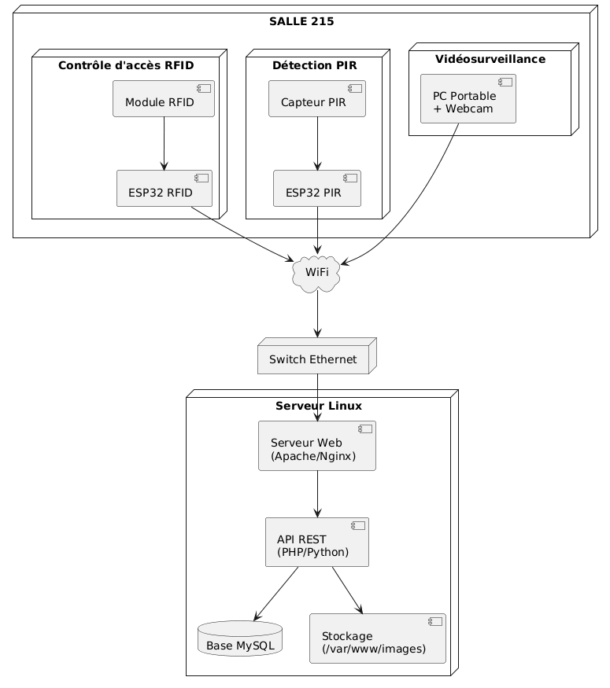
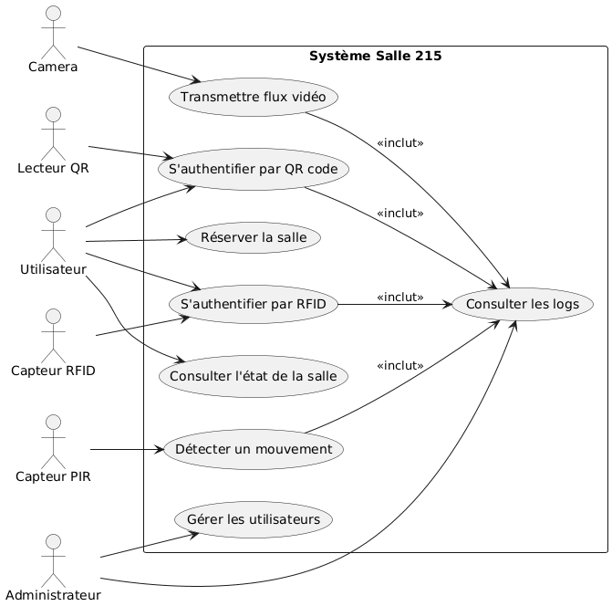
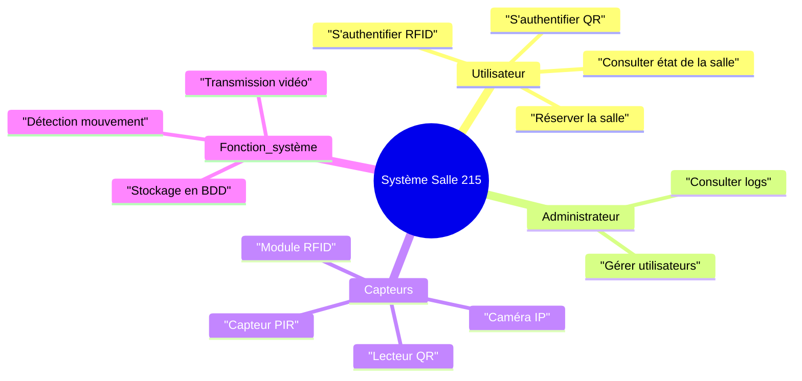
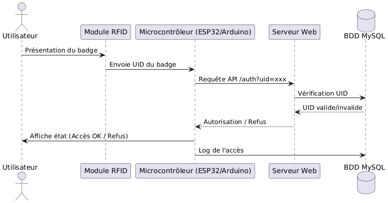
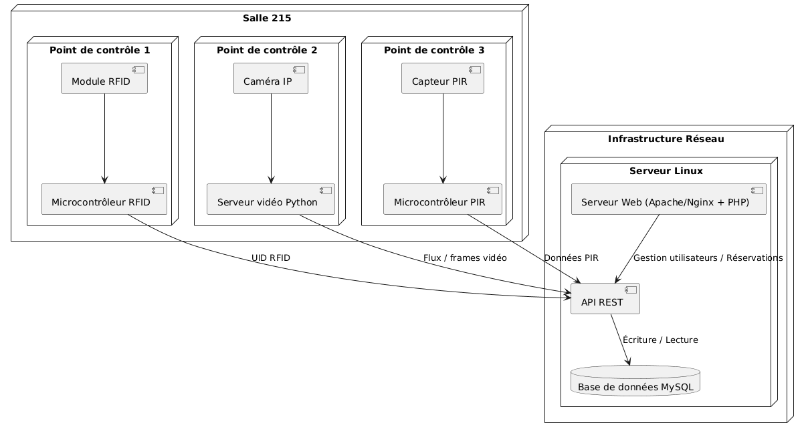
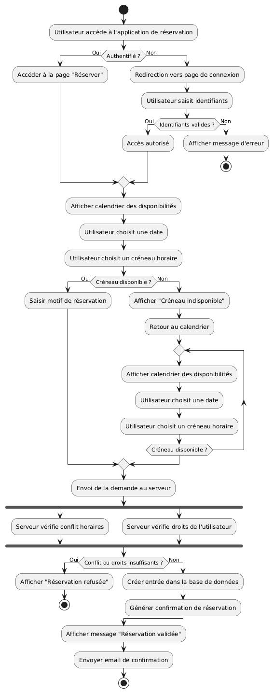
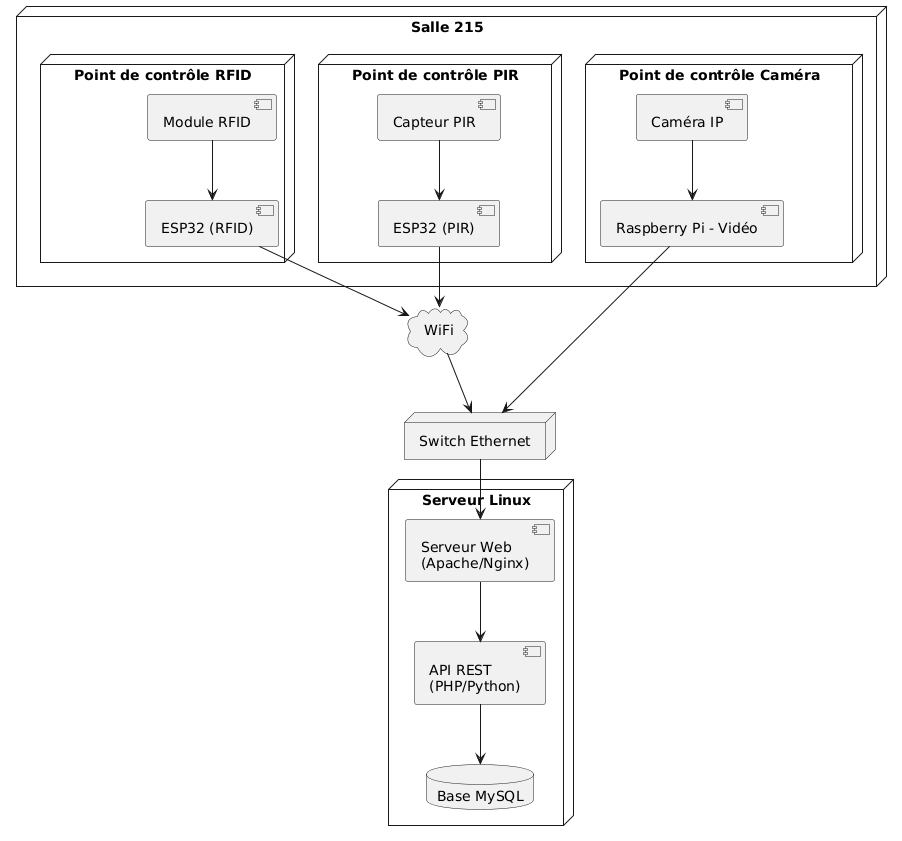
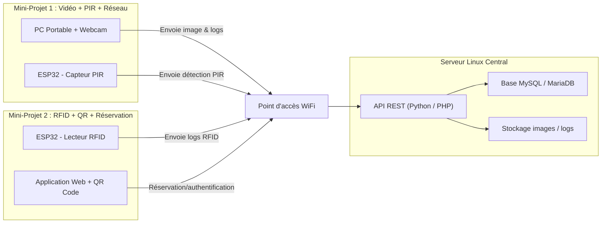

# Mini-Projet – Système de contrôle d’accès et de surveillance dynamique

### Table des matières :

* [Logiciels et supports](#LOG)
* [Présentation](#PP)
* [Cahier des charges et expression du besoin](#CC)
* [Répartition des tâches](#RT)

  * [Mini-Projet 1](#MP1)
  * [Mini-Projet 2](#MP2)
* [Prérequis](#PR)
* [Objectifs](#OB)
* [Processus de développement logiciel](#PDL)

  * [Exemples d’étapes](#PDLE)

---

<a id="PP"></a>

## <cite><font color="#F2A900"> Présentation : </font></cite>

Ce projet consiste à concevoir et développer un **système complet de contrôle d'accès et de surveillance dynamique**, piloté via une interface informatique.
Le dispositif repose sur plusieurs **points de contrôle** installés dans la salle 215 et comprend :

* un système de **vidéosurveillance**,
* un **module de détection de mouvement**,
* un **contrôle d’accès RFID / QR code**,
* des capteurs connectés à un **ESP32**,
* une interface Web permettant l’affichage d’informations, de vidéos et d’alertes.

Ce système vise à **automatiser la gestion de la salle**, à **informer les utilisateurs** et à **améliorer la sécurité**.

---

<a id="CC"></a>

## <cite><font color="#F2A900"> Cahier des charges et expression du besoin : </font></cite>

L’établissement souhaite équiper la salle 215 d’un **système intelligent de contrôle d’accès et de surveillance**, capable d’évoluer selon les besoins, le budget ou l’infrastructure réseau.

Le système devra :

### Fonctionnalités principales

* Afficher l’état d’occupation de la salle (libre / occupée / réservée).
* Gérer l’accès via **badge RFID**, **QR code** ou autre identifiant numérique.
* Surveiller en temps réel grâce à une **caméra** et un **capteur de mouvement**.
* Enregistrer les événements dans une **base de données centrale**.

### Automatisation intégrée

* Extinction automatique des lumières lorsque la salle est vide (temporisation 2 minutes).
* Envoi d’alertes ou notifications lors d’événements particuliers (détection de mouvement inhabituel, accès refusé, etc.).

### Évolutivité

* Possibilité d’ajouter des modules supplémentaires (nouveaux points de contrôle).
* Structure réseau pensée pour accueillir ces extensions.

---

<a id="RT"></a>

## <cite><font color="#F2A900"> Répartition des tâches : </font></cite>

La gestion du projet est décomposée en deux mini-projets complémentaires.

### MP1 : Vidéo + Détection PIR + Réseau

* Équipe de 4-5 étudiants
* Responsabilités :

  * Installation PC webcam et traitement OpenCV
  * Détection de mouvement et capture d’images
  * Configuration du réseau et communication vers le serveur
  * Tests et documentation

### MP2 : Contrôle d’accès RFID + QR + Réservation

* Équipe de 4-5 étudiants
* Responsabilités :

  * Programmation ESP32 pour le RFID
  * Développement du QR code et interface web de réservation
  * Interaction avec le serveur Linux et la BDD
  * Documentation et tests

---

<a id="MP1"></a>

### <cite><font color="#F2A900"> Mini-Projet 1 : Surveillance – Capteurs – Infrastructure </font></cite>

### **Tâche 1 : Vidéosurveillance (M.R., C.R.)**

| Fonctionnalités           | Détails                                                |
| ------------------------- | ------------------------------------------------------ |
| Installation de la caméra | Mise en place du matériel, configuration du flux vidéo |
| Développement Python      | Programme de surveillance et détection d’événements    |
| Base de données           | Enregistrement des images, logs et métadonnées         |
| Documentation             | Manuel technique + schémas                             |
| Rapport                   | Compte-rendu détaillé                                  |

#### Remarques :

Au lieu de stocker l’image **dans** la BDD, on stocke l’image **dans un dossier sur le serveur**, et on stocke **seulement le chemin** dans la base.

Exemple :

1. Le PC détecte un mouvement
2. Il capture une image `img_2026-10-01_11h32.jpg`
3. Il envoie l’image via API au serveur Linux
4. Le serveur **stocke l’image dans `/var/www/images/`**
5. La BDD stocke seulement :

```
id_log | timestamp      | type          | file_path
---------------------------------------------------------------
1452   | 2026-10-01 11:32:04 | detection_mouvement | /images/img_2026...
``` 

```
[ESP32 PIR] ----> [Serveur Linux - API] ---> [BDD logs PIR]
                       ↑
                       |
[PC Portable Webcam] --|--> Envoi des images + logs vidéo
                       |
                       ↓
               [Stockage images détectées]
```

Le PC portable joue le rôle de :

* système de vidéosurveillance
* analyse OpenCV
* capture image en cas de mouvement
* envoi des alertes/images au serveur


---

### **Tâche 2 : Détection de mouvement (M.G., N.M.)**

| Fonctionnalités             | Détails                                |
| --------------------------- | -------------------------------------- |
| Installation du module PIR  | Montage, tests de portée               |
| Développement C++ (Arduino) | Gestion des événements + temporisation |
| Base de données             | Stockage des détections                |
| Documentation               | Spécifications + diagrammes            |
| Rapport                     | Analyse des résultats                  |

---

### **Tâche 3 : Infrastructure réseau et serveurs (L.B.)**

| Fonctionnalités            | Détails                               |
| -------------------------- | ------------------------------------- |
| Installation serveur Linux | Virtualisation, configuration de base |
| Mise en place services Web | Apache/Nginx, PHP                     |
| SGBD                       | MySQL/MariaDB, création de schémas    |
| Configuration complète     | Firewall, utilisateurs, accès réseau  |
| Documentation & Rapport    | Architecture réseau + procédures      |

---

<a id="MP2"></a>

### <cite><font color="#F2A900"> Mini-Projet 2 : Contrôle d’accès – Authentification – Interface Web </font></cite>

### **Tâche 1 : Contrôle d’accès RFID (A.P., Y.S.)**

| Fonctionnalités             | Détails                                    |
| --------------------------- | ------------------------------------------ |
| Installation du module RFID | Câblage + tests                            |
| Développement C++           | Vérification d'identité, gestion des refus |
| Base de données             | Stockage logs d’accès                      |
| Documentation & rapport     | Description technique complète             |

---

### **Tâche 2 : QR code et authentification Web (T.G., N.N.)**

| Fonctionnalités            | Détails                            |
| -------------------------- | ---------------------------------- |
| Développement en PHP       | Génération & scan de QR codes      |
| Application de réservation | Interface utilisateur + planning   |
| Base de données            | Utilisateurs, réservations, droits |
| Documentation & rapport    | Manuel utilisateur + API           |

---

### **Tâche 3 : Serveur – SGBD – Web (G.F., Y.H.)**

| Fonctionnalités            | Détails                               |
| -------------------------- | ------------------------------------- |
| Installation serveur Linux | Virtualisation, configuration de base |
| Mise en place services Web | Apache/Nginx, PHP                     |
| SGBD                       | MySQL/MariaDB, création de schémas    |
| Configuration complète     | Firewall, utilisateurs, accès réseau  |
| Documentation & Rapport    | Architecture réseau + procédures      |

Identique au Mini-Projet 1, mais pour la partie réservée aux modules de contrôle d’accès et à l’interface Web (optimisation, sécurité, extensions).

---

Le système :

| Module            | Équipement               | Rôle                  |
| ----------------- | ------------------------ | --------------------- |
| Capteur RFID      | ESP32                    | contrôle d'accès      |
| Capteur PIR       | ESP32                    | détection mouvement   |
| Vidéosurveillance | **PC portable + webcam** | flux + snapshot       |
| Serveur central   | Linux                    | API + Web + BDD       |
| Réservation       | Web PHP                  | gestion planning      |
| Authentification  | PHP / API                | intégration RFID + QR |

---

<a id="PR"></a>

## <cite><font color="blue"> Prérequis </font></cite>

* Connaissances en programmation (Python, C++, PHP)
* Bases en réseaux (Linux, IP, services Web)
* Notions en développement Web / SGBD
* Utilisation microcontrôleurs (Arduino / ESP32)

---

<a id="OB"></a>

## <cite><font color="blue"> Objectifs </font></cite>

* Travailler en équipe et coordonner un projet complet
* Produire une documentation technique professionnelle
* Approfondir les compétences en :

  * programmation embarquée
  * programmation Web
  * administration réseau et serveurs
  * gestion de base de données
* Mettre en place un système informatique complet et fonctionnel

---

<a id="PDL"></a>

## Processus de développement logiciel

Un processus de développement décrit la méthode permettant de **concevoir**, **déployer**, **tester** et **faire évoluer** un logiciel.

Il garantit :

* une bonne organisation du travail
* une qualité du code
* une gestion efficace des risques
* une traçabilité et une continuité du projet

---

<a id="PDLE"></a>

### Exemples de workflows

#### **Cycle classique (en cascade)**

1. Exigences
2. Analyse
3. Conception
4. Implémentation
5. Tests
6. Déploiement
7. Maintenance

#### **Cycle itératif / Agile**

1. Recueil du besoin
2. Faisabilité & prototypage
3. Itérations de développement
4. Intégration continue
5. Tests utilisateur
6. Livraison & amélioration continue

---

**Schéma réseau**



#### PC Portable

* capture la vidéo (en continu)
* détecte le mouvement
* capture une image
* envoie **uniquement le chemin du fichier** au serveur via API REST

#### ESP32 (RFID + PIR)

* communiquent en WiFi
* envoient des données légères (UID badge, détection PIR)

#### Serveur Linux

* reçoit les infos (chemin image + logs)
* stocke les images sur le disque (`/var/www/images`)
* stocke les logs dans MySQL
* fournit l’interface Web de réservation et d’administration

---

## **1. UML – Diagramme de cas d’usage**

## *Système : Contrôle d’accès & surveillance – Salle 215*

### Acteurs :

* **Utilisateur** (étudiant / enseignant)
* **Administrateur**
* **Capteurs** (caméra, PIR, RFID, QR reader)
* **Serveur Web**





---

## **2. UML – Diagramme de séquence**

### *Séquence : Authentification par badge RFID*

Ce diagramme décrit ce qu’il se passe lorsqu’un utilisateur présente son badge pour accéder à la salle.




---

## **3. UML – Diagramme d’architecture (composants)**

### *Architecture du système : Vue globale*



---

## **Diagramme d’activité – Gestion d’une réservation**




### **Lecture du diagramme :**

* authentification de l'utilisateur
* affichage des créneaux disponibles
* sélection de la date et du créneau
* vérification par le serveur :

  * conflits horaires
  * droits de l’utilisateur
* validation / refus
* confirmation et enregistrement dans la base

---

## Annexes

### **1. Schéma réseau complet**



---

### **2. Architecture complète : RPi + ESP32 + Serveur Linux**

#### **1. ESP32 (RFID & PIR) – Rôle IoT**

Les ESP32 jouent le rôle de **microcontrôleurs autonomes** responsables de :

##### *ESP32 – Contrôle d'accès RFID*

* lecture UID via module RFID RC522
* communication WiFi → API REST
* réception réponse : accès autorisé/refusé
* envoi des logs (accès, erreurs, tentatives invalides)

##### *ESP32 – Détection PIR*

* lecture signal du capteur PIR
* gestion temporisation (2 min avant extinction lumière)
* envoi événements vers API
* éventuel pilotage relais (lumières ON/OFF)

➡ Les deux ESP32 **ne stockent rien localement** → tout est poussé vers le serveur.

---

#### **2. Raspberry Pi – Plateforme vidéo et relais capteurs**

Le RPi gère toute la partie :

##### **Flux vidéo & traitement**

* récupération du flux caméra IP (RTSP/HTTP)
* encodage léger via Python (OpenCV)
* détection basique de mouvement (optionnel)
* envoi frames clés au serveur API

##### **Rôle de passerelle**

* sert de nœud réseau **stabilisé** pour la caméra IP
* peut héberger un mini-service MQTT ou une API locale
* communique via Ethernet → meilleure fiabilité

---

#### **3. Serveur Linux – Cœur du système**

Le serveur Linux virtualisé est la **colonne vertébrale** du projet.

##### *Services hébergés :*

* Serveur Web (Apache/Nginx)
* Application Web (PHP)
* API REST (Python ou PHP)
* Serveur de réservation (Interface utilisateur)
* Serveur d’authentification (RFID + QR)
* Dashboard administrateur

##### *Base de données MySQL/MariaDB :*

Contient :

* utilisateurs
* réservations
* logs d’accès RFID
* détections PIR
* logs vidéo
* états de la salle

##### Sécurité :

* gestion des tokens API
* filtrage IP
* HTTPS
* comptes utilisateurs stricts pour MySQL

---

#### **Résumé de l’architecture**

* **ESP32** → capteurs → Envoie données → **API REST**
* **Raspberry Pi** → caméra → encode → **API REST**
* **Serveur Linux** → Web + API + BDD → gère toute la logique
* **Switch + WiFi** → relient tous les modules ensemble

---
---


### **Schéma réseau et flux – MP1 et MP2**



#### Mini-Projet 1 (MP1)

* **PC Portable** : capture vidéo, détecte mouvements, envoie **chemin des images** + logs au serveur.
* **ESP32 PIR** : détecte la présence et envoie logs au serveur.

#### Mini-Projet 2 (MP2)

* **ESP32 RFID** : lecture des badges → logs vers serveur.
* **QR Code + Web** : interface de réservation et authentification → logs + réservations vers serveur.

#### Serveur central

* **API REST** : point d’intégration des deux mini-projets.
* **Base de données** : centralise logs, réservations et chemins images.
* **Stockage** : conserve les images capturées par MP1.

---


### Grille synthèse – Mini-Projet 1 (MP1 : Vidéo + PIR + Réseau)

| Compétence                             | Activité                           | Tâches clés                                             | Barème / Indicateurs                                      |
| -------------------------------------- | ---------------------------------- | ------------------------------------------------------- | --------------------------------------------------------- |
| C08 – Coder                            | R2 – Installation et qualification | R2-T5 : Réalisation des opérations<br>R2-T6 : Recettage | 6 pts – Fonctionnalité et qualité du code                 |
| C10 – Exploiter un réseau informatique | R3 – Exploitation et maintien      | R3-T3 : Supervision<br>R3-T5 : Configuration            | 4 pts – Correcte exploitation et suivi du réseau          |
| C09 – Installer un réseau informatique | R2 – Installation et qualification | R2-T1 à T6                                              | 4 pts – Installation et configuration réseau réussies     |
| C01 – Communiquer                      | R1 – Accompagnement client         | R1-T1 à T3                                              | 3 pts – Qualité des échanges avec l’équipe et utilisateur |
| C03 – Gérer un projet                  | R4 – Gestion de projet             | R4-T1 à T3                                              | 3 pts – Planification et coordination des étapes          |

**Total MP1 : 20 pts**

---

### Grille synthèse – Mini-Projet 2 (MP2 : RFID + QR + Réservation)

| Compétence                             | Activité                           | Tâches clés                                                         | Barème / Indicateurs                                  |
| -------------------------------------- | ---------------------------------- | ------------------------------------------------------------------- | ----------------------------------------------------- |
| C08 – Coder                            | D2 – Développement logiciel        | D2-T3 : Développement / adaptation<br>D2-T5 : Recette et validation | 6 pts – Code fonctionnel et robuste                   |
| C10 – Exploiter un réseau informatique | R3 – Exploitation et maintien      | R3-T3 : Supervision du réseau                                       | 3 pts – Exploitation et supervision correctes         |
| C09 – Installer un réseau informatique | R2 – Installation et qualification | R2-T1 à T6                                                          | 4 pts – Installation et configuration réseau réussies |
| C01 – Communiquer                      | R1 – Accompagnement client         | R1-T1 à T3                                                          | 3 pts – Communication claire et efficace              |
| C03 – Gérer un projet                  | R4 – Gestion de projet             | R4-T1 à T3                                                          | 4 pts – Gestion du projet et coordination de l’équipe |

**Total MP2 : 20 pts**

---
