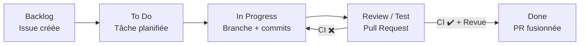

# TP — Introduction à la CI/CD avec GitHub Actions (Python)

## Contexte

Dans un projet informatique, il est essentiel de **vérifier automatiquement** que le code fonctionne après chaque modification.

La **CI (Intégration Continue)** permet d’exécuter automatiquement des tests à chaque :

* `push`
* ouverture ou mise à jour de **pull request**

Dans le workflow GitHub Projects utilisé pour les projets :

* une **Issue** en *In Progress* correspond à un développement en cours ;
* l’ouverture d’une **Pull Request** fait passer la tâche en *Review / Test* ;
* la **CI GitHub Actions** valide (ou non) techniquement le code.

**Règle pratique**

* CI en échec → la carte reste en **Review / Test**
* CI OK + relecture → la carte peut passer en **Done**

Une pull request **dont la CI échoue ne doit pas être fusionnée**.

```
code → tests → CI → statut vert / rouge → décision
```

## Objectifs

* comprendre le rôle de la **CI/CD** dans un projet logiciel
* configurer une **CI simple avec GitHub Actions**
* exécuter des tests automatiquement
* interpréter un statut de pipeline (**vert / rouge**)
* comprendre le lien entre :

  * Issue
  * Pull Request
  * CI GitHub Actions
  * GitHub Projects
* utiliser la CI comme **outil d’aide à la décision**
* comprendre pourquoi une CI verte est **nécessaire mais insuffisante**

## Prérequis

* Compte GitHub
* Bases de Git (`clone`, `add`, `commit`, `push`)
* Bases de Python (fonctions, exceptions)
* Python installé en local :

  * Local : ≥ 3.10
  * CI : 3.11

> *La version de Python peut différer entre local et CI*

---

## Structure du projet

> *Cloner le dépôt GitHub [TP GitHub Projects CI/CD](https://github.com/boudjelaba/TP_GitHub-Projects_CI-CD) qui contient la structure suivante (tous les fichiers sont vides) :*

```
.
├── .github/
│   └── workflows/
│       └── ci.yml           # vide
├── app/
│   └── calculator.py        # vide
├── tests/
│   └── test_calculator.py   # vide
├── .gitignore
├── LICENSE
├── requirements.txt         # vide
└── README.md
```

> Ce dépôt fournit uniquement la structure du projet.
>
> Le contenu des fichiers sera complété durant le TP.

### Travail en local — Environnement Python

**Environnement virtuel**

Vous devez utiliser un environnement virtuel (`venv`) pour pouvoir installer les bibliothèques Python au niveau du système.

L’environnement virtuel (`venv`) sert uniquement à faire fonctionner le projet **en local**, sur votre machine.

**Lien avec la CI / CD**

La CI (et le CD) **n’utilisent pas votre environnement virtuel**.

Lors de l’exécution de la CI :
- GitHub Actions démarre une machine neuve
- Python est installé automatiquement
- les dépendances sont installées à partir de `requirements.txt`
- votre dossier `.venv/` n’est jamais utilisé

> Le seul contrat entre votre machine et la CI est :
> - le code
> - la liste des dépendances
> - les tests

**Création de l’environnement virtuel**

```bash
python -m venv .venv
````

**Activation**

Sous Linux / macOS :

```bash
source .venv/bin/activate
```

Sous Windows :

```powershell
.venv\Scripts\activate
```

> Le venv est **local au projet** et il n’est **pas utilisé par la CI GitHub Actions**.

---

## Codes Python

### `app/calculator.py`

```python
def add(a, b):
    return a + b


def divide(a, b):
    if b == 0:
        raise ValueError("Division par zéro")
    return a / b
```

### `tests/test_calculator.py`

```python
import pytest
from app.calculator import add, divide


def test_add():
    assert add(2, 3) == 5


def test_divide():
    assert divide(10, 2) == 5


def test_divide_by_zero():

    with pytest.raises(ValueError):
        divide(10, 0)
    # OU
    # with pytest.raises(ValueError, match="Division par zéro"):
    #     divide(10, 0)

```

> *Si une erreur d’import apparaît, vérifiez que vous lancez `pytest` depuis la racine du projet.*

### `requirements.txt`

```
pytest
```

---

## CI avec GitHub Actions

### Workflow CI

**`.github/workflows/ci-cd.yml`**

```yaml
name: CI Python

on:
  push:
    branches: [ "main" ]
  pull_request:

jobs:
  ci:
    name: Tests (CI)
    runs-on: ubuntu-latest

    steps:
      - name: Récupération du code
        uses: actions/checkout@v4

      - name: Installation de Python
        uses: actions/setup-python@v5
        with:
          python-version: "3.11"

      - name: Installation des dépendances
        run: |
          python -m pip install --upgrade pip
          pip install -r requirements.txt

      - name: Exécution des tests
        run: pytest
```

---

## Déroulé de TP

### 1. Mise en place locale

1. Cloner le dépôt :

  ```bash
  git clone https://github.com/boudjelaba/TP_GitHub-Projects_CI-CD.git
  cd <nom_du_depot>
  ```

  * Créer l'environnement virtuel et l'activer

2. Étudier le code :

   * À quoi servent `add` et `divide` ?
   * Que vérifie chaque test ?

3. Installer les dépendances :

```bash
pip install -r requirements.txt
```

4. Vérification

  ```bash
  python --version
  pip list
  ```

5. Lancer les tests :

```bash
pytest
```

6. Si une erreur s'est produite lors de ces étapes (après avoir activé le venv) :

  ```bash
  python check_setup.py
  ```

**Questions :**

* Les tests passent-ils ?
* Pourquoi est-il important de tester **avant** la CI ?

> *“la CI fera exactement la même chose, mais sur un serveur GitHub”*

---

### 2. Comprendre la CI GitHub Actions

**Remarque :**
  
> "La CI n’utilise pas votre venv : elle recrée son propre environnement."

* GitHub Actions démarre une machine Linux **neuve**
* Python est installé via `actions/setup-python`
* les dépendances sont installées **dans l’environnement CI**
* le venv local **n’est jamais utilisé**

> La CI **reproduit le projet**, pas votre machine.

1. Ajouter le workflow CI : `.github/workflows/ci-cd.yml`
2. Commit + push :

```bash
git add .
git commit -m "Initialisation du projet"
git push
```

3. Aller dans **GitHub → Actions**

Observer :

* les logs
* le statut du workflow
* l’icône verte ou rouge

**Question :**

* Que signifie une CI verte ?

---

### 3. Casser la CI volontairement 

#### 3.1 Modifier le code

Dans `calculator.py`, modifier la fonction `add` :

```python
def add(a, b):
    return a - b
```

Commit et push.

**Questions :**

* Que devient la CI ?
* Quel test échoue ?
* Pourquoi le workflow s’arrête-t-il ?

> Un job échoue dès qu’une commande retourne un code ≠ 0.

#### 3.2 Corriger l’erreur

* Corriger la fonction `add`.
* Commit + push

**Question :**

* Pourquoi la CI redevient-elle verte ?

---

### 4. CI et Pull Request 

#### 4.1 Créer une branche

```bash
git checkout -b fix-divide
```

Modifier la fonction `divide` (exemple : changer le message d’erreur).

Commit et push.

> La CI **ne bloque rien** tant qu’aucune PR n’est ouverte.

#### 4.2 Ouvrir une Pull Request

* Ouvrir une PR vers `main`
* Observer la CI associée à la PR

> * Une PR déclenche toujours la CI
> * Une PR avec CI rouge ne doit pas être fusionnée

---

## 5. GitHub Projects et suivi du travail

### 5.1 Créer un GitHub Project

Créer un **GitHub Project (v2)** de type *Board* :

Colonnes :

* Backlog
* To Do
* In Progress
* Review / Test
* Done

### 5.2 Issue → Code → PR

1. Créer une Issue :

   * Titre : *Implémenter la calculatrice*
   * Description :

     ```
     - Vérifier les fonctions add et divide
     - S'assurer que les tests passent
     ```

2. Ajouter l’Issue au Project → *To Do*
3. Passer la carte en *In Progress*
4. Créer une branche depuis l’Issue
  
  ```bash
  git checkout -b feature/calculator
  ```
  * Faire un commit et pousser la branche

5. Ouvrir une PR (Pull Request) avec :

  ```
  Closes #<numéro_issue>
  ```

6. Déplacer la carte en *Review / Test*

### 5.3 Lien CI ↔ Project

#### Cas CI ✖️

* PR non fusionnable
* Carte reste en *Review / Test*
* Action : 
  * corriger le code
  * pousser un nouveau commit
  * relancer la CI

#### Cas CI ✔️

* Code validé techniquement
* Revue humaine possible
* Merge autorisé
* Carte → *Done*

> **La CI donne une information technique. La décision reste humaine.**

### 5.4. CI ≠ Code parfait

**Ce que garantit une CI verte**

* Les tests existants passent
* Le code est exécutable dans un environnement propre

**Ce que la CI ne garantit PAS**

* Qualité du design
* Absence de bugs non testés
* Performance
* Lisibilité

---
---

### 6.0 (Optionnel) Aller plus loin — Introduction au CD

Cette partie est hors périmètre du TP principal.
Elle vise à montrer comment un déploiement peut être automatisé
une fois la CI validée.

### 6. CD - Déploiement fictif (avec GitHub Actions)

**Principe du CD fictif**

* CI : vérifie le code
* CD : applique le changement
* Le déploiement est **simulé**
* Aucun serveur réel

> *On automatise le processus, pas l’infrastructure.*

```
Commit → Pull Request → CI (tests)
                 ✖️ → corrections
                 ✔️
                  ↓
               Merge main
                  ↓
          CD (déploiement fictif)
```

#### 6.1. Modifier le workflow CI → CI + CD

On va **ajouter un second job** qui représente le déploiement.

##### `.github/workflows/ci-cd.yml`

```yaml
name: CI/CD Python

on:
  pull_request:
  push:
    branches:
      - main

jobs:
  ci:
    name: Tests (CI)
    runs-on: ubuntu-latest

    steps:
      - name: Récupération du code
        uses: actions/checkout@v4

      - name: Installation de Python
        uses: actions/setup-python@v5
        with:
          python-version: "3.11"

      - name: Installation des dépendances
        run: |
          python -m pip install --upgrade pip
          pip install -r requirements.txt

      - name: Exécution des tests
        run: pytest

  cd:
    name: Déploiement fictif (CD)
    needs: ci
    runs-on: ubuntu-latest

    if: github.ref == 'refs/heads/main'

    steps:
      - name: Début du déploiement
        run: |
          echo "Déploiement en cours..."
          echo "Application calculator version 1.0"

      - name: Simulation du déploiement
        run: |
          echo "Connexion au serveur..."
          sleep 2
          echo "Copie des fichiers..."
          sleep 2
          echo "Redémarrage du service..."
          sleep 2

      - name: Déploiement terminé
        run: |
          echo "Déploiement réussi"
```

> *La CI utilise Python 3.11 (version stable récente).
> Vous pourrez l’aligner avec votre version locale.*

Le job CD :

* dépend du job CI (`needs`)
* ne s’exécute que sur `main`

| CI                | CD                 |
| ----------------- | ------------------ |
| Tests             | Déploiement        |
| À chaque PR       | Après merge        |
| Empêche le merge  | Met en production  |
| Statut rouge/vert | Action automatique |

**Le rôle de `needs`**

```yaml
cd:
  needs: ci
```

> Le CD ne s’exécute **que si la CI réussit**

---

### 7. CD avec environnements

**Règles**

* PR → CI uniquement
* Merge `main` → déploiement **staging automatique**
* Production :

  * validation manuelle
  * environnement protégé

Environnements GitHub :

* `staging`
* `production`

#### 7.1. Préparation GitHub

**Créer les environnements**

Dans le repo GitHub :

1. **Settings → Environments**
2. Créer :

   * `staging`
   * `production`

**Protéger l’environnement `production`**

Pour `production` :

* Activer **Required reviewers**
* Ajouter l’enseignant (ou un rôle fictif)

> Le déploiement en prod nécessite une **approbation manuelle**

#### 7.2. Workflow CI/CD avec environnements

**`.github/workflows/ci-cd.yml`**

```yaml
name: CI/CD Python (Staging → Prod)

on:
  pull_request:
  push:
    branches:
      - main

jobs:
  ci:
    name: CI — Tests
    runs-on: ubuntu-latest

    steps:
      - uses: actions/checkout@v4

      - uses: actions/setup-python@v5
        with:
          python-version: "3.11"

      - name: Installer dépendances
        run: |
          python -m pip install --upgrade pip
          pip install -r requirements.txt

      - name: Lancer les tests
        run: pytest

  deploy_staging:
    name: CD — Déploiement staging
    needs: ci
    runs-on: ubuntu-latest
    environment: staging

    if: github.ref == 'refs/heads/main'

    steps:
      - name: Déploiement staging
        run: |
          echo "Déploiement en STAGING"
          echo "Version: 1.0.0"
          sleep 2
          echo "Staging OK"

  deploy_production:
    name: CD — Déploiement production
    needs: deploy_staging
    runs-on: ubuntu-latest
    environment: production

    if: github.ref == 'refs/heads/main'

    steps:
      - name: Déploiement production
        run: |
          echo "Déploiement en PRODUCTION"
          echo "Version: 1.0.0"
          sleep 2
          echo "Production OK"
```

#### 7.3. Observations

**Lors d’une Pull Request**

* La CI s’exécute
* Aucun déploiement
* Pourquoi ?

  > Parce que le code n’est pas encore validé

**Après le merge dans `main`**

Dans l’onglet **Actions** :

1. CI passe ✔️
2. Déploiement **staging** démarre automatiquement
3. Déploiement **production** est :

   * en attente
   * bloqué par approbation

> Icône 🔒 visible dans GitHub Actions

**Validation manuelle production**

* Cliquer sur **Review deployments**
* Approuver
* Observer :

  * le job production démarre
  * le workflow se termine


| Colonne Project | État réel          |
| --------------- | ------------------ |
| In Progress     | Développement      |
| Review / Test   | PR ouverte + CI    |
| Staging         | Déployé en staging |
| Production      | Déployé en prod    |
| Done            | Prod validée       |

> On peut :

* ajouter une colonne **Staging**
* garder **Done = prod OK**

#### 7.4. Bonus

* Ajouter un badge CI dans le README
* Ajouter un nouveau test
* Modifier la CI pour utiliser Python 3.10 au lieu de 3.11

---

### 8. Conclusion

* La CI automatise la validation
* Le CD automatise l’application
* GitHub Projects visualise l’état du travail
* La CI est un **filet de sécurité**, pas une contrainte

> GitHub Projects permet de **visualiser l’état du travail**,
> GitHub Actions permet de **valider techniquement le code**.

> **Un code non testé n’est pas terminé.**
> **Une PR sans CI verte ne doit pas être fusionnée.**

---


#### 8.4 **Exercice**

1. Créer une Issue :
   `Ajouter la fonction multiply(a, b)`

2. Ajouter la carte au Project (To Do → In Progress)

3. Créer une branche :

   ```bash
   git checkout -b feature/multiply
   ```

4. Implémenter :

   * la fonction `multiply(a, b)` dans `calculator.py`
   * les tests associés dans `test_calculator.py`

5. Vérifier les tests en local

6. Ouvrir une Pull Request

7. Observer la CI

8. Fusionner si la CI est verte

9. Observer le déploiement staging / prod

---

#### 8.5. Conclusion

- La CI automatise la validation du code
- Le CD automatise l’application du changement
- La CI protège le projet
- Le CD protège l’environnement

La technique n’est pas l’objectif.
Le processus, la fiabilité et la collaboration le sont.

> Un code sans tests n’est pas terminé.
> Une PR sans CI verte ne doit pas être fusionnée.

---

### 9. Annexe

#### 9.1. Workflow + CI

```
┌───────────┐
│ Backlog   │
│           │  Idées, tâches identifiées
│  Issue    │
└─────┬─────┘
      │ Planification
      ▼
┌───────────┐
│ To Do     │
│           │  Tâche prête
│  Issue    │
└─────┬─────┘
      │ Début du travail
      ▼
┌──────────────┐
│ In Progress  │
│              │  Branche créée
│  Issue +     │  Commits réguliers
│  Branche    │
└─────┬────────┘
      │ PR ouverte
      ▼
┌──────────────────┐
│ Review / Test    │◀───────────────┐
│                  │                │
│ Pull Request     │   ✖️ CI KO      │
│ + CI GitHub      │   Corrections   │
│ Actions          │                │
└─────┬────────────┘                │
      │ ✔ Revue OK + CI OK           │
      ▼                              │
┌───────────┐                        │
│ Done      │────────────────────────┘
│           │  PR fusionnée
│  Issue    │  Code intégré dans main
└───────────┘
```

**Note**

> **La CI se déclenche quand la carte est en Review.**
> **Si la CI échoue, la tâche ne peut pas passer en Done.**

#### 9.2. Mermaid



La CI (GitHub Actions) :
- se déclenche à l’ouverture ou la mise à jour d’une PR
- lance automatiquement les tests
- valide (ou non) le code