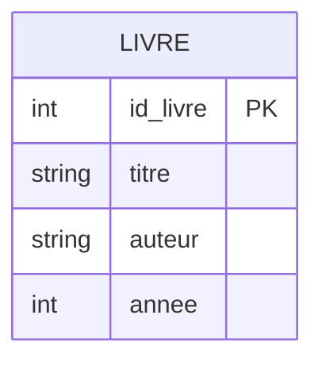
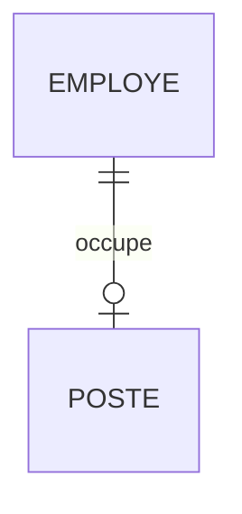
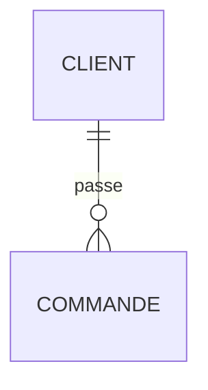
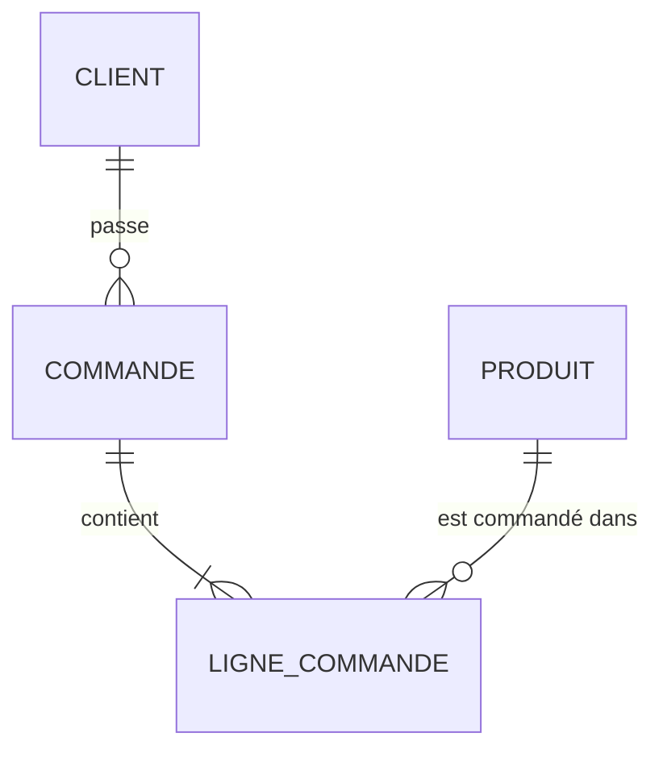

## Entité (table) LIVRE



 Correspondance SQL :

```sql
CREATE TABLE livre (
    id_livre INT PRIMARY KEY,
    titre VARCHAR(100),
    auteur VARCHAR(100),
    annee INT
);
```

---

# Cardinalités / multiplicités

## Notation Crow’s Foot

Très utilisée pour représenter les modèles de données et les diagrammes entité-association. Les symboles placés aux extrémités des associations indiquent la cardinalité :

- `|` ou `||` : exactement **un**
- `O` : **zéro** (participation facultative)
- `<` / pied de corbeau : **plusieurs**
- `O|` : **zéro ou un**
- `|<` : **un ou plusieurs**
- `O<` : **zéro ou plusieurs**

### Exemple : relation Employé ↔ Poste



**Lecture :**

- Un **employé** occupe **un et un seul poste** (`||` côté POSTE)
- Un **poste** peut être occupé par **zéro ou un employé** (`o|` côté EMPLOYE)

## Notation de Chen

La notation de Chen est une notation classique des modèles **entité-association**. Les entités sont généralement représentées par des rectangles et les associations par des losanges.

La cardinalité peut être exprimée par des contraintes telles que :

- **1:1** : un à un
- **1:N** : un à plusieurs
- **N:N** : plusieurs à plusieurs

Dans les descriptions plus détaillées, on peut également exprimer des bornes minimales et maximales, par exemple :

- `(0,1)` : zéro ou un
- `(1,1)` : exactement un
- `(0,N)` : zéro ou plusieurs
- `(1,N)` : un ou plusieurs

> Il vaut mieux présenter `(0,1)`, `(1,1)`, etc. comme une **notation des bornes de cardinalité**, et non comme les symboles propres à la notation de Chen.

## Multiplicité UML

UML utilise directement les multiplicités aux extrémités des associations :

- `1` : exactement un
- `0..1` : zéro ou un
- `0..*` : zéro ou plusieurs
- `1..*` : un ou plusieurs
- `n` : exactement `n`
- `m..n` : de `m` à `n`

### Exemple : relation Client ↔ Commande



**Lecture :**

- Un **client** peut passer **zéro ou plusieurs commandes** (`o{` côté COMMANDE)
- Une **commande** appartient à **un et un seul client** (`||` côté CLIENT)

### Résumé : tableau comparatif des notations

| Signification     | Crow's Foot | UML    | Bornes min/max | Exemple           |
| ----------------- | ----------- | ------ | -------------- | ----------------- |
| Un et un seul     | `\|\|`      | `1`    | `(1,1)`        | `A \|\|--\|\| B`  |
| Zéro ou un        | `O\|`       | `0..1` | `(0,1)`        | `A \|\|--o\| B`   |
| Un ou plusieurs   | `\|<`       | `1..*` | `(1,N)`        | `A \|\|--\|{ B`   |
| Zéro ou plusieurs | `O<`        | `0..*` | `(0,N)`        | `A \|\|--o{ B`    |

---

## Lecture des cardinalités

### Exemple avec plusieurs relations



**Lecture :**

- Un **client** passe **zéro ou plusieurs commandes**
- Une **commande** contient **une ou plusieurs lignes de commande**
- Un **produit** peut apparaître dans **zéro ou plusieurs lignes de commande**

