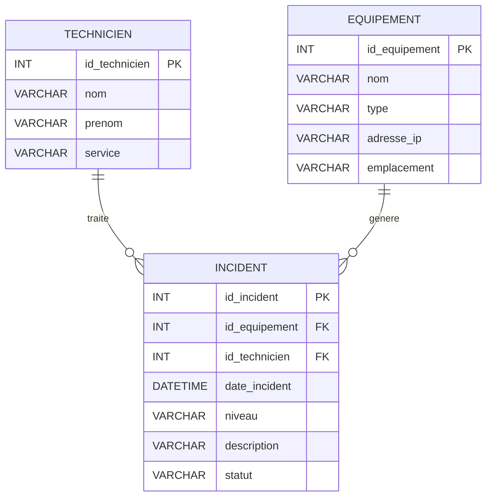

# Cours SQL (révision)

## Gestion d’une base de données de supervision réseau

### Contexte

Une entreprise dispose d'une petite infrastructure informatique composée de serveurs, de commutateurs, de routeurs et de bornes Wi-Fi.

Un système de supervision collecte les événements et incidents détectés sur les équipements.

La base de données `supervision` permettra notamment de :

- référencer les équipements du réseau ;
- enregistrer les techniciens chargés de l'exploitation ;
- enregistrer les incidents détectés ;
- rechercher les incidents ;
- réaliser des statistiques ;
- gérer les droits d'accès à la base ;
- sauvegarder et restaurer les données.

La base de données contiendra trois tables :

- `equipement` : les équipements présents sur le réseau ;
- `technicien` : les personnes chargées de l'exploitation ;
- `incident` : les incidents ou événements détectés.

---

## Modèle de données

Le schéma ci-dessous représente les principales entités de notre base de données et leurs relations. Il est réalisé avec la notation ER de Mermaid.

Dans notre application, un incident peut éventuellement ne pas encore être affecté à un technicien.



### Lecture du schéma

- `PK` = clé primaire.
- `FK` = clé étrangère.
- `TECHNICIEN ||--o{ INCIDENT` signifie qu'un technicien peut traiter **0 à plusieurs incidents**.
- `EQUIPEMENT ||--o{ INCIDENT` signifie qu'un équipement est à l'origine de **0 à plusieurs incidents**.
- Un incident concerne **un seul équipement**.
- Un incident peut être affecté à **0 ou 1 technicien**.

---

# Partie 1 – Gestion des bases et des tables

## 1.1 Créer une base de données

```sql
CREATE DATABASE supervision;
-- OU (pour vérifier au préable si la BDD n'existe pas)
CREATE DATABASE IF NOT EXISTS supervision;
```

Sélectionner la base :

```sql
USE supervision;
```

---

## 1.2 Créer une table

On commence par créer la table `technicien`.

```sql
CREATE TABLE technicien (
    id_technicien INT PRIMARY KEY AUTO_INCREMENT,
    nom VARCHAR(50) NOT NULL,
    prenom VARCHAR(50) NOT NULL,
    service VARCHAR(50) NOT NULL
);
```

### Afficher la structure

```sql
DESCRIBE technicien;
```

---

## Exercice 1

Créer la table `equipement` avec les champs suivants :

- `id_equipement` : entier, clé primaire, auto-incrémenté ;
- `nom` : nom de l'équipement ;
- `type` : type d'équipement ;
- `adresse_ip` : adresse IPv4 ;
- `emplacement` : emplacement physique.

Les champs `nom`, `type` et `adresse_ip` devront être obligatoires.

Puis afficher la structure de la table.


<details>
<summary> Correction</summary>

```sql
CREATE TABLE equipement (
id_equipement INT PRIMARY KEY AUTO_INCREMENT,
nom VARCHAR(50) NOT NULL,
type VARCHAR(30) NOT NULL,
adresse_ip VARCHAR(15) NOT NULL,
emplacement VARCHAR(50)
);

DESCRIBE equipement;
```

>`VARCHAR(15)` permet de stocker une adresse IPv4 sous forme de texte. Cette définition ne vérifie toutefois pas que la valeur saisie est une adresse IPv4 valide.

</details>

---

## Exercice 2

Créer la table `incident` avec :

- `id_incident` : entier, clé primaire, auto-incrémenté ;
- `id_equipement` : identifiant de l'équipement concerné ;
- `id_technicien` : identifiant du technicien ayant traité l'incident ;
- `date_incident` : date et heure de l'incident ;
- `niveau` : niveau de gravité ;
- `description` : description de l'incident ;
- `statut` : état de traitement de l'incident.

Les clés étrangères devront être correctement définies.

<details>
<summary> Correction</summary>

```sql
CREATE TABLE incident (
id_incident INT PRIMARY KEY AUTO_INCREMENT,
id_equipement INT NOT NULL,
id_technicien INT,
date_incident DATETIME NOT NULL,
niveau VARCHAR(20) NOT NULL,
description VARCHAR(255) NOT NULL,
statut VARCHAR(20) NOT NULL,

FOREIGN KEY (id_equipement)
  REFERENCES equipement(id_equipement),

FOREIGN KEY (id_technicien)
  REFERENCES technicien(id_technicien)
);
```

Afficher la structure :

```sql
DESCRIBE incident;
```

</details>

---

### Pourquoi créer les tables dans cet ordre ?

La table `incident` contient des clés étrangères qui font référence aux tables `equipement` et `technicien`.

Il faut donc créer :

```
1. technicien
2. equipement
3. incident
```

et non l'inverse.

---

# Partie 2 – CRUD

CRUD signifie :

| Lettre | Opération | SQL |
| --- | --- | --- |
| C | Create | `INSERT` |
| R | Read | `SELECT` |
| U | Update | `UPDATE` |
| D | Delete | `DELETE` |

---

## 2.1 INSERT – Ajouter des données

Ajouter des techniciens :

```sql
INSERT INTO technicien (nom, prenom, service)
VALUES
('Dupont', 'Alice', 'Informatique'),
('Martin', 'Paul', 'Réseau'),
('Durand', 'Emma', 'Informatique');
```

Comme `id_technicien` est `AUTO_INCREMENT`, il n'est pas nécessaire de fournir sa valeur.

Ajouter des équipements :

```sql
INSERT INTO equipement
(nom, type, adresse_ip, emplacement)
VALUES
('SW-CORE-01', 'Switch', '192.168.1.1', 'Baie réseau'),
('RTR-01', 'Routeur', '192.168.1.254', 'Baie réseau'),
('SRV-01', 'Serveur', '192.168.1.10', 'Salle serveur'),
('AP-01', 'WiFi', '192.168.1.20', 'Bureau 1');
```

---

## 2.2 SELECT – Lire

Afficher tous les équipements :

```sql
SELECT *
FROM equipement;
```

Afficher uniquement leur nom et leur adresse IP :

```sql
SELECT nom, adresse_ip
FROM equipement;
```

Afficher les techniciens :

```sql
SELECT *
FROM technicien;
```

---

## 2.3 UPDATE – Modifier

Modifier l'adresse IP d'un équipement :

```sql
UPDATE equipement
SET adresse_ip = '192.168.1.2'
WHERE id_equipement = 1;
```

> Toujours vérifier la clause `WHERE`.

Sans `WHERE` :

```sql
UPDATE equipement
SET adresse_ip = '192.168.1.2';
```

tous les équipements seraient modifiés.

---

## 2.4 DELETE – Supprimer

Supprimer un équipement :

```sql
DELETE FROM equipement
WHERE id_equipement = 4;
```

>Attention : un équipement associé à des incidents peut ne pas pouvoir être supprimé à cause de la clé étrangère.

---

## Exercice 3 – CRUD

Écrire les requêtes permettant de :

1. Ajouter un serveur nommé `SRV-WEB` avec l'adresse IP `192.168.1.30`.
2. Afficher tous les équipements.
3. Modifier son adresse IP en `192.168.1.31`.
4. Supprimer cet équipement.

<details>
<summary> Correction</summary>

```sql
-- 1. Ajouter
INSERT INTO equipement
(nom, type, adresse_ip, emplacement)
VALUES
('SRV-WEB', 'Serveur', '192.168.1.30', 'Salle serveur');

-- 2. Afficher
SELECT *
FROM equipement;

-- 3. Modifier
UPDATE equipement
SET adresse_ip = '192.168.1.31'
WHERE nom = 'SRV-WEB';

-- 4. Supprimer
DELETE FROM equipement
WHERE nom = 'SRV-WEB';
```

**OU :**

```sql
-- 1. Ajouter
INSERT INTO equipement
(nom, type, adresse_ip, emplacement)
VALUES
('SRV-WEB', 'Serveur', '192.168.1.30', 'Salle serveur');

-- 2. Afficher
SELECT *
FROM equipement;

-- 3. Vérifier l'ID_EQUIPEMENT
SELECT id_equipement, nom
FROM equipement
WHERE nom = 'SRV-WEB';

--- 4. Modifier
UPDATE equipement
SET adresse_ip = '192.168.1.31'
WHERE id_equipement = ...; -- Celui affiché dans l'étape 3

-- 5. Supprimer
DELETE FROM equipement
WHERE id_equipement = ...; -- Celui affiché dans l'étape 3
```

>Pour modifier ou supprimer une ligne précise, on privilégie généralement son identifiant unique.

</details>

---

# Partie 3 – Requêtes courantes

## 3.1 WHERE

Afficher uniquement les serveurs :

```sql
SELECT *
FROM equipement
WHERE type = 'Serveur';
```

Afficher les incidents critiques :

```sql
SELECT *
FROM incident
WHERE niveau = 'Critique';
```

Afficher les incidents encore ouverts :

```sql
SELECT *
FROM incident
WHERE statut = 'Ouvert';
```

---

## 3.2 ORDER BY

Trier les équipements par nom :

```sql
SELECT *
FROM equipement
ORDER BY nom;
```

Ordre décroissant :

```sql
SELECT *
FROM equipement
ORDER BY nom DESC;
```

Trier les incidents du plus récent au plus ancien :

```sql
SELECT *
FROM incident
ORDER BY date_incident DESC;
```

---

## 3.3 LIKE

Rechercher les équipements dont le nom commence par `SW` :

```sql
SELECT *
FROM equipement
WHERE nom LIKE 'SW%';
```

Rechercher les incidents contenant le mot `connexion` :

```sql
SELECT *
FROM incident
WHERE description LIKE '%connexion%';
```

`%` signifie « n'importe quelle suite de caractères ».

**Insérer des données à la table `incident`**

```sql
INSERT INTO incident
(id_equipement, id_technicien, date_incident, niveau, description, statut)
VALUES
(1, 1, '2026-09-15 08:15:00', 'Critique',
 'Perte de connexion avec le commutateur',
 'Ouvert'),

(1, 2, '2026-09-15 09:30:00', 'Avertissement',
 'Temps de réponse élevé',
 'Traité'),

(1, 3, '2026-09-15 10:30:00', 'Avertissement',
 'Perte de paquets détectée',
 'Ouvert');

(3, NULL, '2026-09-15 10:00:00', 'Critique',
 'Serveur inaccessible',
 'Ouvert'),

(2, 2, '2026-09-15 10:10:00', 'Information',
 'Redémarrage du routeur',
 'Traité');
```

---
---

## 3.4 Les jointures SQL (`JOIN`)

Jusqu'à présent, nous avons interrogé une seule table à la fois.

Par exemple :

```
SELECT *
FROM equipement;
```

Cette requête permet d'afficher les informations contenues dans la table `equipement`.

Mais les informations d'une base de données sont généralement **réparties dans plusieurs tables**.

Par exemple :

```
EQUIPEMENT
-------------------------
id_equipement
nom
type
adresse_ip
```

et :

```
INCIDENT
-------------------------
id_incident
id_equipement
date_incident
niveau
description
statut
```

La table `incident` ne contient pas le nom de l'équipement. Elle contient seulement son identifiant :

```
incident.id_equipement
```

Cet identifiant permet de retrouver l'équipement correspondant dans la table `equipement`.

---

## Pourquoi utiliser une jointure ?

Supposons que nous ayons :

### Table `equipement`

| id\_equipement | nom | adresse\_ip |
| --- | --- | --- |
| 1 | SW-CORE-01 | 192.168.1.1 |
| 2 | RTR-01 | 192.168.1.254 |
| 3 | SRV-01 | 192.168.1.10 |

### Table `incident`

| id\_incident | id\_equipement | niveau | statut |
| --- | --- | --- | --- |
| 1 | 1 | Critique | Ouvert |
| 2 | 1 | Avertissement | Traité |
| 3 | 3 | Critique | Ouvert |

Si on affiche uniquement la table `incident`, on obtient :

```
id_incident | id_equipement | niveau
------------+---------------+-----------
1           | 1             | Critique
2           | 1             | Avertissement
3           | 3             | Critique
```

Mais le responsable informatique voudrait plutôt voir :

```
équipement   | adresse_ip    | niveau
--------------+---------------+-----------
SW-CORE-01   | 192.168.1.1   | Critique
SW-CORE-01   | 192.168.1.1   | Avertissement
SRV-01       | 192.168.1.10  | Critique
```

Il faut donc **relier les deux tables**.

C'est le rôle de la jointure.

---

## Le principe d'une jointure

La jointure consiste à mettre en relation deux tables grâce à une colonne commune.

Dans notre cas :

```
EQUIPEMENT                         INCIDENT
------------------                ------------------
id_equipement  <----------------  id_equipement
nom                               id_incident
adresse_ip                        niveau
                                statut
```

La colonne :

```
equipement.id_equipement
```

correspond à :

```
incident.id_equipement
```

Dans `equipement`, `id_equipement` est la **clé primaire (PK)**.

Dans `incident`, `id_equipement` est une **clé étrangère (FK)**.

La clé étrangère permet donc de retrouver l'équipement concerné par un incident.

---

## La syntaxe de base

Une jointure s'écrit généralement ainsi :

```sql
SELECT colonnes
FROM table1
JOIN table2
ON table1.colonne = table2.colonne;
```

Le mot `ON` indique **comment les deux tables doivent être reliées**.

---

## Exemple

Afficher les incidents avec le nom de l'équipement :

```sql
SELECT e.nom, i.niveau, i.statut
FROM equipement AS e
JOIN incident AS i
ON e.id_equipement = i.id_equipement;
```

Décomposons cette requête.

### 1\. `FROM`

```sql
FROM equipement AS e
```

On part de la table `equipement`.

`e` est un **alias** : un nom court donné à la table.

On pourra donc écrire :

```sql
e.nom
e.adresse_ip
e.id_equipement
```

au lieu de :

```sql
equipement.nom
equipement.adresse_ip
equipement.id_equipement
```

### 2\. `JOIN`

```sql
JOIN incident AS i
```

On ajoute la table `incident`.

`i` est l'alias de la table `incident`.

On peut donc écrire :

```sql
i.niveau
i.statut
i.date_incident
```

### 3\. `ON`

```sql
ON e.id_equipement = i.id_equipement
```

C'est la partie essentielle de la jointure.

Elle indique :

> Pour chaque équipement, rechercher les incidents dont `id_equipement` est identique.

Autrement dit :

```
e.id_equipement = i.id_equipement
```

---

## Comment lire la requête ?

On peut lire :

```sql
SELECT e.nom, i.niveau, i.statut
FROM equipement AS e
JOIN incident AS i
ON e.id_equipement = i.id_equipement;
```

comme ceci :

> « Afficher le nom de l'équipement, le niveau et le statut de l'incident, en reliant les équipements et les incidents grâce à leur identifiant commun. »

---

## Attention à ne pas confondre `WHERE` et `ON`

`ON` sert à **relier les tables**.

`WHERE` sert à **filtrer les résultats**.

Par exemple, afficher uniquement les incidents critiques :

```sql
SELECT e.nom, i.niveau, i.statut
FROM equipement AS e
JOIN incident AS i
ON e.id_equipement = i.id_equipement
WHERE i.niveau = 'Critique';
```

On peut donc avoir les deux :

```
ON      → comment relier les tables ?
WHERE   → quelles lignes conserver ?
```

## Exercice 3a – 2 tables

Écrire une requête permettant d'afficher :

- le nom de l'équipement ;
- son adresse IP ;
- la date de l'incident ;
- le niveau de l'incident.

On utilisera les tables `equipement` et `incident`.

<details>
<summary> Correction</summary>

```sql
SELECT
e.nom,
e.adresse_ip,
i.date_incident,
i.niveau
FROM equipement AS e
JOIN incident AS i
ON e.id_equipement = i.id_equipement;
```

</details>

---

## Une jointure avec trois tables

Il est possible de relier plusieurs tables.

Dans notre base :

```
TECHNICIEN
   |
   | id_technicien
   |
INCIDENT
   |
   | id_equipement
   |
EQUIPEMENT
```

On peut donc obtenir des informations provenant des trois tables :

```sql
SELECT
e.nom AS equipement,
e.adresse_ip,
t.nom AS technicien,
i.niveau,
i.statut
FROM incident AS i
JOIN equipement AS e
ON i.id_equipement = e.id_equipement
LEFT JOIN technicien AS t
ON i.id_technicien = t.id_technicien;
```

Cette requête permet par exemple d'obtenir :

```
équipement | adresse_ip   | technicien | niveau   | statut
-----------+--------------+------------+----------+---------
SW-CORE-01 | 192.168.1.1  | Dupont     | Critique | Ouvert
SRV-01     | 192.168.1.10 | Martin     | Critique | Traité
```

---

## `JOIN` ou `LEFT JOIN` ?

Il existe plusieurs types de jointures.

Dans ce cours, nous utiliserons principalement :

### `JOIN` / `INNER JOIN`

```sql
JOIN incident AS i
-- ou INNER JOIN incident AS i
ON e.id_equipement = i.id_equipement
```

Cette jointure conserve uniquement les lignes qui ont une correspondance dans les deux tables.

Par exemple, un équipement sans incident n'apparaîtra pas.

### `LEFT JOIN`

```sql
LEFT JOIN incident AS i
ON e.id_equipement = i.id_equipement
```

Cette jointure conserve **tous les équipements**, même ceux qui n'ont aucun incident.

Cela est particulièrement utile en supervision :

> « On veut connaître tous les équipements, y compris ceux qui n'ont généré aucun incident. »

---

## Note

Une jointure permet de **récupérer des informations provenant de plusieurs tables**.

Le lien entre les tables est généralement réalisé grâce à :

```
clé primaire (PK)
      ↓
clé étrangère (FK)
```

La structure générale est :

```sql
SELECT ...
FROM table1
JOIN table2
ON table1.cle = table2.cle;
```

Et pour filtrer les résultats :

```sql
SELECT ...
FROM table1
JOIN table2
ON table1.cle = table2.cle
WHERE condition;
```

### Méthode

Avant d'écrire une jointure, se poser trois questions :

1. **Quelles tables dois-je utiliser ?**
2. **Quelle colonne permet de les relier ?**
3. **Quelles informations dois-je afficher ?**

Exemple :

```
On veut :
→ le nom de l'équipement
→ son adresse IP
→ le niveau de l'incident

Tables :
→ equipement
→ incident

Lien :
→ equipement.id_equipement
→ incident.id_equipement
```

On peut alors construire :

```sql
SELECT e.nom, e.adresse_ip, i.niveau
FROM equipement AS e
JOIN incident AS i
ON e.id_equipement = i.id_equipement;
```

## Exercice 3b – 3 tables

Écrire une requête permettant d'afficher :

- le nom de l'équipement ;
- son adresse IP ;
- le niveau de l'incident ;
- le nom du technicien ;
- la date de l'incident.

On utilisera les trois tables.

<details>
<summary> Correction</summary>

```sql
SELECT
e.nom AS equipement,
e.adresse_ip,
i.niveau,
t.nom AS technicien,
i.date_incident
FROM equipement AS e
JOIN incident AS i
ON e.id_equipement = i.id_equipement
LEFT JOIN technicien AS t
ON i.id_technicien = t.id_technicien;
```

On utilise ici `LEFT JOIN` car un incident peut ne pas encore être affecté à un technicien.

</details>

---

# Partie 4 – Agrégations

Les fonctions d'agrégation permettent de réaliser des calculs sur plusieurs lignes.

| Fonction | Utilisation |
| --- | --- |
| `COUNT()` | compter |
| `SUM()` | additionner |
| `AVG()` | calculer une moyenne |
| `MIN()` | trouver un minimum |
| `MAX()` | trouver un maximum |

### Exemple

Compter le nombre d'équipements :

```sql
SELECT COUNT(*) AS nombre_equipements
FROM equipement;
```

Compter le nombre d'incidents :

```sql
SELECT COUNT(*) AS nombre_incidents
FROM incident;
```

## GROUP BY

Compter le nombre d'incidents par équipement :

```sql
SELECT
id_equipement,
COUNT(*) AS nombre_incidents
FROM incident
GROUP BY id_equipement;
```

Ou, en utilisant les jointures :

```sql
SELECT
e.nom,
COUNT(i.id_incident) AS nombre_incidents
FROM equipement AS e
LEFT JOIN incident AS i
ON e.id_equipement = i.id_equipement
GROUP BY e.id_equipement, e.nom;
```

## HAVING

Afficher uniquement les équipements ayant généré au moins 2 incidents :

```sql
SELECT
id_equipement,
COUNT(*) AS nombre_incidents
FROM incident
GROUP BY id_equipement
HAVING COUNT(*) >= 2;
```

## Exercice 4-a

Écrire les requêtes permettant de :

1. Compter le nombre d'équipements.
2. Compter le nombre d'incidents.
3. Compter le nombre d'incidents par équipement.
4. Compter le nombre d'incidents par niveau.
5. Afficher les équipements ayant généré au moins 2 incidents.
6. Compter le nombre d'incidents ouverts.

<details>
<summary> Correction</summary>

```sql
-- 1. Nombre d'équipements
SELECT COUNT(*) AS nombre_equipements
FROM equipement;

-- 2. Nombre d'incidents
SELECT COUNT(*) AS nombre_incidents
FROM incident;

-- 3. Nombre d'incidents par équipement
SELECT
id_equipement,
COUNT(*) AS nombre_incidents
FROM incident
GROUP BY id_equipement;

-- 4. Nombre d'incidents par niveau
SELECT
niveau,
COUNT(*) AS nombre_incidents
FROM incident
GROUP BY niveau;

-- 5. Équipements ayant au moins 2 incidents
SELECT
id_equipement,
COUNT(*) AS nombre_incidents
FROM incident
GROUP BY id_equipement
HAVING COUNT(*) >= 2;

-- 6. Nombre d'incidents ouverts
SELECT COUNT(*) AS incidents_ouverts
FROM incident
WHERE statut = 'Ouvert';
```

</details>

## Exercice 4-b – Requête de supervision

On souhaite identifier les équipements les plus problématiques.

Écrire une requête permettant d'afficher :

- le nom de l'équipement ;
- son adresse IP ;
- le nombre d'incidents associés.

Trier les résultats du plus grand nombre d'incidents au plus petit.

<details>
<summary> Correction</summary>

```sql
SELECT
e.nom,
e.adresse_ip,
COUNT(i.id_incident) AS nombre_incidents
FROM equipement AS e
LEFT JOIN incident AS i
ON e.id_equipement = i.id_equipement
GROUP BY
e.id_equipement,
e.nom,
e.adresse_ip
ORDER BY nombre_incidents DESC;
```

Le `LEFT JOIN` permet également d'afficher les équipements qui n'ont généré **aucun incident**.

</details>

---

# Partie 5 – Administration de la BDD

Dans une infrastructure informatique, l'administrateur d'une base de données doit notamment :

- gérer les utilisateurs ;
- gérer leurs droits ;
- limiter les accès ;
- surveiller la base ;
- sauvegarder les données ;
- sécuriser les informations.

Il est généralement préférable de donner à un utilisateur **uniquement les droits dont il a besoin**.

## Créer un utilisateur

Exemple MySQL/MariaDB :

```sql
CREATE USER 'supervision_lecture'@'localhost'
IDENTIFIED BY 'MotDePasse123!';
```

## Donner des droits

Donner uniquement le droit de lecture :

```sql
GRANT SELECT
ON supervision.*
TO 'supervision_lecture'@'localhost';
```

Cet utilisateur peut consulter les données de la base, mais ne dispose pas des privilèges `INSERT`, `UPDATE` ou `DELETE`.

## Afficher les droits

```sql
SHOW GRANTS
FOR 'supervision_lecture'@'localhost';
```

## Donner plusieurs droits

Un compte d'exploitation pourrait par exemple disposer de :

```sql
GRANT SELECT, INSERT, UPDATE
ON supervision.*
TO 'supervision_exploitation'@'localhost';
```

Il peut alors consulter, ajouter et modifier les données.

## Retirer un droit

```sql
REVOKE UPDATE
ON supervision.*
FROM 'supervision_exploitation'@'localhost';
```

## Exercice 5-a – Sécurité des droits

On souhaite créer deux comptes :

- `supervision_lecture` : consultation uniquement ;
- `supervision_exploitation` : consultation, ajout et modification.

Écrire les commandes SQL correspondantes.

<details>
<summary> Correction</summary>

```sql
CREATE USER 'supervision_lecture'@'localhost'
IDENTIFIED BY 'MotDePasse123!';

GRANT SELECT
ON supervision.*
TO 'supervision_lecture'@'localhost';

CREATE USER 'supervision_exploitation'@'localhost'
IDENTIFIED BY 'MotDePasse456!';

GRANT SELECT, INSERT, UPDATE
ON supervision.*
TO 'supervision_exploitation'@'localhost';
```

</details>

---

# Partie 6 – Sauvegarde et restauration

Une base de supervision contient des informations importantes sur l'activité du réseau.

Une sauvegarde permet de récupérer les données après :

- une erreur humaine ;
- une panne matérielle ;
- une corruption de données ;
- une mauvaise manipulation ;
- une attaque informatique.

Avec **MySQL/MariaDB**, l'outil classique est `mysqldump`.

## 6.1 Sauvegarder

Dans un terminal :

```bash
mysqldump -u root -p supervision > supervision.sql
```

Le fichier `supervision.sql` contient des instructions SQL permettant notamment de recréer la structure des tables et de réinsérer les données sauvegardées.

## 6.2 Restaurer

Créer la base si nécessaire :

```sql
CREATE DATABASE supervision;
```

Puis, dans un terminal :

```bash
mysql -u root -p supervision < supervision.sql
```

## Exercice 6-a – Sauvegarde

Réaliser les opérations suivantes :

1. Réaliser une sauvegarde de la base `supervision`.
2. Vérifier que le fichier de sauvegarde existe.
3. Supprimer la table `incident`.
4. Vérifier que la base `supervision` existe toujours.
5. Restaurer la sauvegarde.
6. Vérifier que les équipements et les incidents sont toujours présents.

<details>
<summary> Correction</summary>

```bash
# 1. Sauvegarder
mysqldump -u root -p supervision > supervision.sql
```

Après avoir vérifié que le fichier `supervision.sql` existe, supprimer la table `incident` dans MySQL :

```sql
DROP TABLE incident;
```

Restaurer la sauvegarde dans la base `supervision` :

```bash
mysql -u root -p supervision < supervision.sql
```

Vérifier :

```sql
USE supervision;

SHOW TABLES;

SELECT *
FROM equipement;

SELECT *
FROM incident;
```

</details>

---

# Partie 7 – Mise en situation professionnelle

## Exercice 7-a – Analyse d'une infrastructure

Le responsable informatique souhaite obtenir un état de la supervision.

Écrire les requêtes permettant de :

1. Afficher tous les équipements de type `Serveur`.
2. Afficher tous les incidents critiques.
3. Afficher les incidents encore ouverts.
4. Afficher les incidents contenant le mot `connexion`.
5. Afficher les incidents du plus récent au plus ancien.
6. Afficher le nombre d'incidents par niveau.
7. Afficher le nombre d'incidents par équipement.
8. Identifier les équipements ayant au moins 3 incidents.
9. Afficher le nom de l'équipement, le nom et le prénom du technicien, le niveau et le statut de l'incident.
10. Afficher les équipements n'ayant généré aucun incident.

---

<details>
<summary> Correction</summary>

### 1\. Serveurs

```sql
SELECT *
FROM equipement
WHERE type = 'Serveur';
```

### 2\. Incidents critiques

```sql
SELECT *
FROM incident
WHERE niveau = 'Critique';
```

### 3\. Incidents ouverts

```sql
SELECT *
FROM incident
WHERE statut = 'Ouvert';
```

### 4\. Incidents contenant « connexion »

```sql
SELECT *
FROM incident
WHERE description LIKE '%connexion%';
```

### 5\. Incidents les plus récents

```sql
SELECT *
FROM incident
ORDER BY date_incident DESC;
```

### 6\. Nombre d'incidents par niveau

```sql
SELECT
niveau,
COUNT(*) AS nombre
FROM incident
GROUP BY niveau;
```

### 7\. Nombre d'incidents par équipement

```sql
SELECT
id_equipement,
COUNT(*) AS nombre
FROM incident
GROUP BY id_equipement;
```

### 8\. Équipements ayant au moins 3 incidents

```sql
SELECT
id_equipement,
COUNT(*) AS nombre
FROM incident
GROUP BY id_equipement
HAVING COUNT(*) >= 3;
```

### 9\. Équipement et technicien

```sql
SELECT
e.nom AS equipement,
t.nom AS technicien,
t.prenom,
i.niveau,
i.statut
FROM incident AS i
JOIN equipement AS e
ON i.id_equipement = e.id_equipement
LEFT JOIN technicien AS t
ON i.id_technicien = t.id_technicien;
```

### 10\. Équipements sans incident

```sql
SELECT
e.nom,
e.adresse_ip
FROM equipement AS e
LEFT JOIN incident AS i
ON e.id_equipement = i.id_equipement
WHERE i.id_incident IS NULL;
```

</details>

---

## Remarques

- Utiliser des noms de tables et colonnes en **minuscules** et en **anglais** ou **français cohérent**.
- Toujours tester les requêtes `UPDATE` et `DELETE` avec un `SELECT` avant.
- Ajouter des contraintes (`NOT NULL`, `FOREIGN KEY`) dès la création des tables.
- Documenter les scripts SQL avec des commentaires `--`.

---

## Synthèse

```
CRÉER
↓
CREATE DATABASE
CREATE TABLE

AJOUTER
↓
INSERT

LIRE
↓
SELECT
├── WHERE
├── LIKE
├── ORDER BY
├── JOIN
└── LEFT JOIN

MODIFIER
↓
UPDATE

SUPPRIMER
↓
DELETE

CALCULER
↓
COUNT
SUM
AVG
MIN
MAX
GROUP BY
HAVING

ADMINISTRER
↓
CREATE USER
GRANT
REVOKE

PROTÉGER
↓
mysqldump
mysql
```

---
