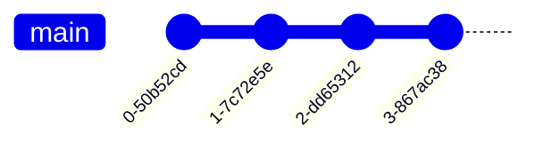
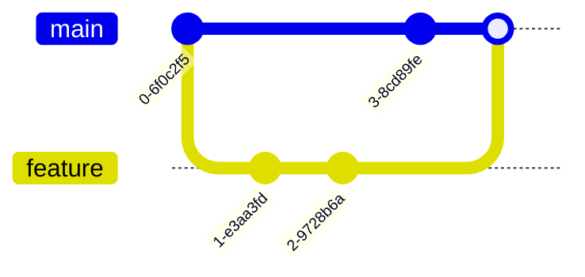

# **Git : Initiation et bonnes pratiques**

## **1. Installation de Git**

### **Site officiel et téléchargement**
- [Site officiel de Git](https://git-scm.com/)
- Télécharger la dernière version pour Windows :
  - [Git for Windows (x64)](https://git-scm.com/download/win)
  - Ou directement depuis [GitHub](https://github.com/git-for-windows/git/releases/tag/v2.51.0.windows.1) (version 2.51.0 au 24/08/2025)

### **Installation**
- Exécuter le fichier `.exe` téléchargé et suivre les instructions.
- Après installation, utiliser **Git Bash** (recommandé) ou tout autre terminal (PowerShell, CMD, etc.).

---

## **2. Configuration initiale**

```bash
# Configurer son identité (remplacer par vos infos)
git config --global user.name "Charles Carnus"
git config --global user.email lycee@carnus.fr

# Définir la branche par défaut
git config --global init.defaultBranch main
```

* Ces 2 premières commandes permettent d’enregistrer votre nom et email pour les commits.
* `init.defaultBranch main` définit le nom de la branche par défaut (au lieu de "master").

* **Vérifier toutes les configurations globales :** Pour lister tous les paramètres globaux configurés.
    ```bash
    git config --global --list
    ```

```bash
# Voir l'aide
git config --help
git config -h    # Aide rapide dans le terminal
git help config  # Ouvre l'aide dans le navigateur (Documentation plus complète)
```

---

## **Palier 1** : init, add, commit, log, status (construire une habitude)

## **3. Initialisation d’un dépôt Git**

```bash
# Se placer dans le répertoire de travail
cd Exp_Git

# Initialiser le dépôt Git
git init  # Crée un dossier caché `.git`

# Vérifier l'état du dépôt (suivi des fichiers)
git status  # Aucun fichier n'est encore suivi
```

* Cela crée un **répertoire `.git` caché** : à ne pas modifier ou suuprimer, c'est lui gère le dépôt Git.

---

## **4. Ajout et suivi des fichiers**

```bash
# Ajouter un fichier spécifique
git add index.html

# Vérifier l'état
git status

# Retirer un fichier de la zone de staging
git rm --cached index.html

# Vérifier l'état
git status
```

---

## **5. Ignorer des fichiers avec `.gitignore`**

- Créer un fichier `.gitignore` à la racine du projet.
- Ajouter les règles suivantes pour ignorer tous les fichiers `.txt` :

```
# Ignorer tous les fichiers .txt
*.txt
```

- Vérifier que les fichiers ignorés n’apparaissent plus :

```bash
git status
```

---

## **6. Commit des modifications**

```bash
# Ajouter tous les fichiers modifiés
git add --all  # ou git add -A ou git add .

# Faire un commit
git commit -m "premier commit - ajout de tous les fichiers dans le dépôt"

# Vérifier l'état
git status
```

---

## **7. Historique des commits**

```bash
# Voir l'historique
git log

# Voir l'historique en une ligne
git log --oneline

# Modifier le dernier commit
git commit --amend -m "Modification du nom de l’image"

# Voir l'historique avec les différences
git log -p

# Aide sur la commande log
git help log
```

### **Le cycle de base Git**

```
[Dossier travail]
      |
      v
 git init
      |
      v
+-------------+        git add
|   WORKDIR   |-------->[STAGING]-------+
+-------------+         (index)         |
         |                |             |
     édition          git commit        |
         |                |             v
         +----------------------------[REPO]
```
- **WORKDIR** : tes fichiers.
- **STAGING** : espace temporaire avant validation (commit).
- **REPO** : l’historique stocké.

```mermaid
flowchart TB
    W[Workdir<br/>(Fichiers de travail)] -->|git add| S[Staging (Index)]
    S -->|git commit| R[Repository (Historique)]
    R-->|git checkout|W
    W-->|modifications|W
```

### **Historique des commits (ligne du temps)**

```
(o)--(o)--(o)--(o)--(o)
 |    |    |    |    |
ID1  ID2  ID3  ID4  ID5
```

- Chaque `(o)` est un **commit**.
- `HEAD` pointe sur le dernier commit.
- Utilise `git log --oneline` ou `git log --graph`.



---

**Palier 2** : suppression, renommage, diff, restauration (apprendre à se tromper et corriger)

## **8. Modifier et comparer des fichiers**

```bash
# Modifier un fichier (ex: index.html)
# Vérifier l'état
git status  # Le fichier modifié doit apparaître

# Voir les différences
git diff

# Ajouter le fichier modifié
git add index.html

# Annuler la mise en staging
git restore --staged index.html

# Commit avec message
git commit -a -m "mise à jour du texte"
```

---

## **9. Suppression et renommage de fichiers**

```bash
# Supprimer un fichier
git rm style.css

# Annuler la suppression
git restore style.css

# Renommer un fichier
git mv logo.png logoY.png

# Commit
git commit -m "Modification du nom du fichier logo"
```


## **Palier 3** : branches et fusions simples (collaborer)  

## **10. Gestion des branches**

### **Créer et utiliser une branche**

```bash
# Créer une nouvelle branche
git branch ChangeLogo

# Lister les branches
git branch

# Changer de branche
git switch ChangeLogo

# Modifier le fichier html (changer le logo)
# Commit
git commit -a -m "mise à jour du logo"

# Revenir sur main
git switch main

# Fusionner la branche
git merge -m "Merge changement de logo dans main" ChangeLogo

# Supprimer la branche
git branch -d ChangeLogo
```

### **Créer et switcher en une seule commande**

```bash
# Créer et switcher vers une nouvelle branche
git switch -c ChangeTexte

# Modifier le texte dans le fichier html
# Commit
git commit -a -m "Modification html"

# Revenir sur main
git switch main

# Modifier le fichier html
# Commit
git commit -a -m "Modification html"

# Fusionner (conflit possible)
git merge ChangeTexte

# Résoudre le conflit dans le fichier html
# Commit après résolution
git commit -a -m "Résolution du conflit"
```

### **Branches et fusion (merge)**

```
main:    (o)--(o)--(o)---------M--->
                    \         /
feature:             (o)-----(o)
```
- Tu crées une branche (`feature`) depuis `main`.
- Tu travailles, commites, puis `git merge feature` dans `main` (point 'M').


### **Résolution de conflit**

```
main:    (o)--(X)     (M)
               \     /
feature:        (Y)-/
```
- (X) et (Y) modifient la même ligne de code sur deux branches différentes.
- Au merge (M), **Git signale le conflit :**
  - Tu dois choisir/éditer avant `git add` puis `git commit`.


---

## **Palier 4** rebase, reset, stash (avancé/bonus)

## **11. Rebase interactif (avancé)**

```bash
# Lancer un rebase interactif
git rebase -i --root
# (Quitter avec Ctrl+Q si besoin)
```

---

## **12. Réinitialiser un fichier**

```bash
# Réinitialiser un fichier à un état précédent
git reset LeNuméroDuCommit
```


### **Exemple de workflow "Feature Branch"**

1. part de `main`
2. crée une branche *nouvelle-feature*
3. travaille et commit
4. revient sur *main* et merge

```
main:    (o)--(o)------(o)---merge-->
                 \
feature:          (o)-----(o)
```
- Recommandé pour tout ajout/fix séparé !



***

### **Schéma simple du workflow Git (en équipe)**

```
          +---------------------+
          |  Rép. central (GitHub) 
          +-----------+---------+
                      ^
     git push / pull  |      git clone
                      |
+---------+          +--------+
| Dev A   |<-------> | Dev B  |
+---------+          +--------+
```
- Chaque dev a son clone local.
- Chacun commit, puis `push` sur le repo central.
- Toujours faire un `pull` avant de travailler et de `push`.


***

### **Gitflow simplifié (bonus/OdG équipe)**

```
main ------->---------->
           \
develop ----o---o---------
             \    \
feature1      o    o
```
- `main` reçoit les versions officielles/taggées.
- `develop` → pré-prod/integration.
- Chaque “feature” a sa branche.


***

### **Utilitaires et logs**

- Réinitialiser sans paniquer !
  - `git restore --staged <fichier>`
  - `git checkout <id_commit> <fichier>`
- Visualiser l'historique (forme de graphe) :
  - `git log --oneline --graph --decorate`

***

#### **Legend (Légende des symboles)**
| Symbole | Signification      |
|---------|--------------------|
| (o)     | commit             |
| ------  | avance dans le temps |
| /, \    | création/dérivation de branche |
| M       | point de merge     |


---

## **13. Bonnes pratiques et conseils**

- **Commits atomiques** : Un commit = une modification logique.
- **Messages de commit clairs** : Utiliser l’impératif ("Ajouter", "Corriger", "Supprimer").
- **Branches courtes** : Une branche = une fonctionnalité ou un correctif.
- **`.gitignore`** : Toujours ignorer les fichiers temporaires, logs, etc.
- **Pull avant push** : Toujours faire un `git pull` avant un `git push` pour éviter les conflits.

---

## **14. Résumé des commandes utiles**

| Commande | Description |
|----------|-------------|
| `git init` | Initialiser un dépôt |
| `git add <fichier>` | Ajouter un fichier à la zone de staging |
| `git commit -m "message"` | Valider les modifications |
| `git status` | Voir l’état du dépôt |
| `git log` | Voir l’historique des commits |
| `git branch` | Lister les branches |
| `git switch <branche>` | Changer de branche |
| `git merge <branche>` | Fusionner une branche |
| `git pull` | Récupérer les modifications distantes |
| `git push` | Envoyer les modifications distantes |

---

## **TP : Git en ligne de commande**

### **Objectifs**
- Maîtriser les commandes de base de Git.
- Savoir créer, modifier, commiter, brancher et fusionner.
- Comprendre la résolution de conflits.

---

### **Prérequis**
- Git installé et configuré.
- Un terminal (Git Bash, PowerShell, etc.).
- Un éditeur de texte (VS Code, Notepad++, etc.).

---

### **Énoncé**

#### **1. Initialisation et premier commit**
1. Créez un dossier `tp1_git` sur votre bureau.
2. Dans ce dossier, initialisez un dépôt Git.
3. Configurez votre nom et email si ce n’est pas déjà fait.
4. Créez un fichier `index.html` avec le contenu suivant :
   ```html
   <!DOCTYPE html>
   <html>
   <head>
       <title>Mon premier site</title>
   </head>
   <body>
       <h1>Bienvenue sur mon site</h1>
   </body>
   </html>
   ```
5. Ajoutez ce fichier à la zone de staging et faites un commit avec le message `"Ajout de la structure de base"`.

---

#### **2. Modification et historique**
1. Modifiez le fichier `index.html` en ajoutant un paragraphe :
   ```html
   <p>Ce site est versionné avec Git.</p>
   ```
2. Vérifiez les modifications avec `git diff`.
3. Ajoutez le fichier modifié à la zone de staging et faites un commit avec le message `"Ajout d'un paragraphe"`.
4. Affichez l’historique des commits avec `git log --oneline`.
5. Créez un bug volontaire, puis utilisez :
    ```bash
    git checkout commit_id fichier
    ```
    → pour restaurer l’ancienne version de ce fichier.

---

#### **3. Création et fusion de branches**
1. Créez une branche `ajout-style`.
2. Basculez sur cette branche.
3. Créez un fichier `style.css` avec le contenu suivant :
   ```css
   body {
       font-family: Arial;
       background-color: lightblue;
   }
   ```
4. Ajoutez et commitez ce fichier avec le message `"Ajout du fichier CSS"`.
5. Revenez sur la branche `main`.
6. Fusionnez la branche `ajout-style` dans `main`.
7. Supprimez la branche `ajout-style`.
8. Visualisez l’historique en graphe :
  ```bash
  git log --oneline --graph
  ```

---

#### **4. Résolution de conflit**
1. Créez une branche `modif-accueil`.
2. Basculez sur cette branche et modifiez le `<h1>` dans `index.html` :
   ```html
   <h1>Bienvenue sur mon site version 2</h1>
   ```
3. Commitez avec le message `"Modification du titre"`.
4. Revenez sur `main` et modifiez le même `<h1>` :
   ```html
   <h1>Site en construction</h1>
   ```
5. Commitez avec le message `"Changement du titre"`.
6. Fusionnez `modif-accueil` dans `main`. Un conflit devrait apparaître.
7. Résolvez le conflit en gardant le texte `"Bienvenue sur mon site version 2"`.
8. Commitez la résolution.

---

#### **5. Ignorer des fichiers**
1. Créez un fichier `notes.txt` avec du texte quelconque.
2. Configurez `.gitignore` pour ignorer tous les fichiers `.txt`.
3. Vérifiez avec `git status` que `notes.txt` n’est pas suivi.

---

#### **6. Annulation et rebase**
1. Créez un fichier `script.js` et commitez-le avec le message `"Ajout d'un script"`.
2. Annulez ce commit avec `git reset --soft HEAD~1`.
3. Vérifiez que le fichier est toujours présent mais non commité.
4. Recommitez-le avec le message `"Ajout d'un script (v2)"`.

---

### **Solution attendue**
- Un dépôt Git avec un historique propre, sans conflits non résolus.
- Les fichiers `index.html`, `style.css`, `script.js` et `.gitignore` correctement versionnés.
