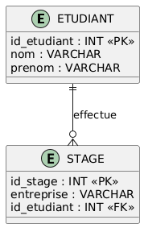
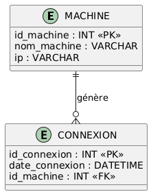
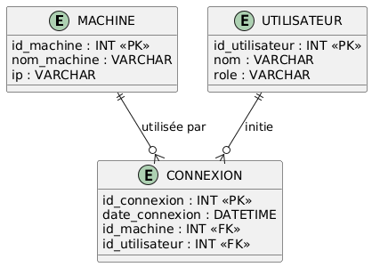

# SQL - Jointures

## Contexte

Gestion des étudiants et des stages.

## Schéma de la base de données



## Tables de départ (avant jointure)

* Emma (_etudiant 3) et Hugo (_etudiant 4) **n’ont pas de stage**
* Un stage **peut ne pas être affecté à un étudiant**

<div style="display: flex; gap: 40px;">

<div>

### Table `ETUDIANT`

| id_etudiant | nom     | prenom |
| ----------- | ------- | ------ |
| 1           | Martin  | Alice  |
| 2           | Dupont  | Lucas  |
| 3           | Bernard | Emma   |
| 4           | Petit   | Hugo   |

</div>

<div>

### Table `STAGE`

| id_stage | entreprise | id_etudiant |
| -------- | ---------- | ----------- |
| 101      | Orange     | 1           |
| 102      | Capgemini  | 2           |
| 103      | IBM        | 2           |
| 104      | Atos       | NULL        |

</div>

</div>

**Condition de jointure (la règle)**

```sql
ETUDIANT.id_etudiant = STAGE.id_etudiant
```

> « SQL va comparer chaque étudiant avec chaque stage »

---

## INNER JOIN (ce qui correspond dans les deux tables)

**Construction du tableau intermédiaire**

<div style="display: flex; gap: 30px;">

<div>

### Comparaisons valides

| Étudiant  | Stage         | Match |
| --------- | ------------- | ----- |
| Alice (1) | Orange (1)    |  ✔    |
| Lucas (2) | Capgemini (2) |  ✔    |
| Lucas (2) | IBM (2)       |  ✔    |

</div>

<div>

### Ignorés

| Cas  | Raison           |
| ---- | ---------------- |
| Emma | aucun stage      |
| Hugo | aucun stage      |
| Atos | id_etudiant NULL |

</div>

</div>

**Tableau intermédiaire**

| nom    | prenom | entreprise |
| ------ | ------ | ---------- |
| Martin | Alice  | Orange     |
| Dupont | Lucas  | Capgemini  |
| Dupont | Lucas  | IBM        |

> « INNER JOIN = seulement les lignes qui matchent »

---

<div style="display: flex; gap: 20px;">

<div style="width: 33%;">

### Requête SQL

```sql
SELECT nom, prenom, entreprise
FROM ETUDIANT
INNER JOIN STAGE
ON ETUDIANT.id_etudiant = STAGE.id_etudiant;
```

</div>

<div style="width: 33%;">

### Ce que fait la jointure

* Garde **uniquement** : les étudiants **ayant un stage**

</div>

<div style="width: 33%;">

### Résultat

| nom    | prenom | entreprise |
| ------ | ------ | ---------- |
| Martin | Alice  | Orange     |
| Dupont | Lucas  | Capgemini  |
| Dupont | Lucas  | IBM        |

</div>

</div>

## LEFT JOIN (tout ce qui est à gauche)

> « On garde **tous les étudiants**, même sans correspondance »

**Tableau intermédiaire**

| nom     | prenom | entreprise |
| ------- | ------ | ---------- |
| Martin  | Alice  | Orange     |
| Dupont  | Lucas  | Capgemini  |
| Dupont  | Lucas  | IBM        |
| Bernard | Emma   | NULL       |
| Petit   | Hugo   | NULL       |

> « Quand SQL ne trouve rien → il met NULL »

---

<div style="display: flex; gap: 20px;">

<div style="width: 33%;">

### Requête SQL

```sql
SELECT nom, prenom, entreprise
FROM ETUDIANT
LEFT JOIN STAGE
ON ETUDIANT.id_etudiant = STAGE.id_etudiant;
```

</div>

<div style="width: 33%;">

### Ce que fait la jointure

* Garde **tous les étudiants** : Même **sans stage**

</div>

<div style="width: 33%;">

### Résultat

| nom     | prenom | entreprise |
| ------- | ------ | ---------- |
| Martin  | Alice  | Orange     |
| Dupont  | Lucas  | Capgemini  |
| Dupont  | Lucas  | IBM        |
| Bernard | Emma   | NULL       |
| Petit   | Hugo   | NULL       |

</div>

</div>

**Note**

> LEFT JOIN = *"Je pars de la table ETUDIANT et je complète si possible"*

## RIGHT JOIN

> « On garde **tous les stages**, même sans étudiant »

**Tableau intermédiaire**

| nom    | prenom | entreprise |
| ------ | ------ | ---------- |
| Martin | Alice  | Orange     |
| Dupont | Lucas  | Capgemini  |
| Dupont | Lucas  | IBM        |
| NULL   | NULL   | Atos       |

> *RIGHT JOIN = la table de droite gagne*

---

<div style="display: flex; gap: 20px;">

<div style="width: 33%;">

### Requête SQL

```sql
SELECT nom, prenom, entreprise
FROM ETUDIANT
RIGHT JOIN STAGE
ON ETUDIANT.id_etudiant = STAGE.id_etudiant;
```

</div>

<div style="width: 33%;">

### Ce que fait la jointure

* Garde **tous les stages** : Même **sans étudiant**

</div>

<div style="width: 33%;">

### Résultat

| nom    | prenom | entreprise |
| ------ | ------ | ---------- |
| Martin | Alice  | Orange     |
| Dupont | Lucas  | Capgemini  |
| Dupont | Lucas  | IBM        |
| NULL   | NULL   | Atos       |

</div>

</div>

## Jointure + WHERE (erreur classique à expliquer)

### Mauvaise pratique (perte du LEFT JOIN)

```sql
SELECT nom, prenom, entreprise
FROM ETUDIANT
LEFT JOIN STAGE
ON ETUDIANT.id_etudiant = STAGE.id_etudiant
WHERE entreprise = 'Orange';
```

* SQL **supprime les lignes avec NULL**
* Résultat = **INNER JOIN déguisé**

### Bonne pratique

```sql
SELECT nom, prenom, entreprise
FROM ETUDIANT
LEFT JOIN STAGE
ON ETUDIANT.id_etudiant = STAGE.id_etudiant
AND entreprise = 'Orange';
```

* SQL garde tous les étudiants
* Orange seulement si ça correspond

## Résumé

| Jointure      | Signification                        |
| ------------- | ------------------------------------ |
| INNER JOIN    | Seulement ce qui correspond          |
| LEFT JOIN     | Tout à gauche + correspondances      |
| RIGHT JOIN    | Tout à droite + correspondances      |
| WHERE IS NULL | Ce qui n’a **pas** de correspondance |

---
---

## Exercice 1 – Compréhension

> Afficher **tous les étudiants** avec leur entreprise de stage s’ils en ont une.

---

## Exercice 2 – Filtrage

> Afficher **uniquement les étudiants sans stage**

Indice :

```sql
WHERE entreprise IS NULL
```

---

## Exercice 3 – Raisonnement

> Afficher **les stages non affectés à un étudiant**

---

## Exercice 4 – Défi

> Afficher le **nombre de stages par étudiant** (y compris ceux qui en ont 0)

---

## Remarque

> « Une jointure, ce n’est pas une requête, c’est **un tableau intermédiaire** que SQL fabrique avant le SELECT »

---

## Corrigé – Jointures SQL

## Exercice 1

Afficher **tous les étudiants**, même ceux **sans stage**.

```sql
SELECT nom, prenom, entreprise
FROM ETUDIANT
LEFT JOIN STAGE
ON ETUDIANT.id_etudiant = STAGE.id_etudiant;
```

| nom     | prenom | entreprise |
| ------- | ------ | ---------- |
| Martin  | Alice  | Orange     |
| Dupont  | Lucas  | Capgemini  |
| Dupont  | Lucas  | IBM        |
| Bernard | Emma   | NULL       |
| Petit   | Hugo   | NULL       |

* **LEFT JOIN** → on garde **tous les étudiants**
* S’il n’y a pas de correspondance → `NULL`

## Exercice 2

Afficher **uniquement les étudiants qui n’ont pas de stage**.

```sql
SELECT nom, prenom
FROM ETUDIANT
LEFT JOIN STAGE
ON ETUDIANT.id_etudiant = STAGE.id_etudiant
WHERE STAGE.id_stage IS NULL;
```

| nom     | prenom |
| ------- | ------ |
| Bernard | Emma   |
| Petit   | Hugo   |

* Le `LEFT JOIN` crée des lignes avec `NULL`
* `WHERE id_stage IS NULL` = *pas de correspondance*

> *“NULL = pas trouvé dans la table de droite”*

## Exercice 3

Afficher les **stages sans étudiant**.

```sql
SELECT entreprise
FROM STAGE
LEFT JOIN ETUDIANT
ON STAGE.id_etudiant = ETUDIANT.id_etudiant
WHERE ETUDIANT.id_etudiant IS NULL;
```

| entreprise |
| ---------- |
| Atos       |

* On inverse la logique :

  * STAGE devient la table de gauche
* `NULL` → aucun étudiant associé

> *“LEFT JOIN dépend de la table que je mets à gauche”*

## Exercice 4

Afficher le **nombre de stages par étudiant**, même ceux qui n’en ont aucun.

```sql
SELECT nom, prenom, COUNT(STAGE.id_stage) AS nb_stages
FROM ETUDIANT
LEFT JOIN STAGE
ON ETUDIANT.id_etudiant = STAGE.id_etudiant
GROUP BY nom, prenom;
```

| nom     | prenom | nb_stages |
| ------- | ------ | --------- |
| Martin  | Alice  | 1         |
| Dupont  | Lucas  | 2         |
| Bernard | Emma   | 0         |
| Petit   | Hugo   | 0         |

* `COUNT(id_stage)` **ne compte pas les NULL**
* `LEFT JOIN` garantit que tous les étudiants sont présents
* `GROUP BY` regroupe par étudiant


---
---


## TP SQL – Jointures en contexte réseau

On souhaite analyser les **connexions réseau** dans un parc informatique.

* Une **machine** peut se connecter plusieurs fois
* Une **machine peut ne jamais s’être connectée**
* Une **connexion peut être orpheline** (machine inconnue ou supprimée)

## Schéma de la base de données



* Une **machine** peut générer **0 à n connexions**
* Une **connexion** peut être **sans machine** (`id_machine NULL`)

## Données de départ

### MACHINE

| id_machine | nom_machine | ip           |
| ---------- | ----------- | ------------ |
| 1          | PC-ADMIN    | 192.168.1.10 |
| 2          | PC-SALLE1   | 192.168.1.20 |
| 3          | PC-SALLE2   | 192.168.1.21 |
| 4          | PC-LABO     | 192.168.1.30 |

### CONNEXION

| id_connexion | date_connexion   | id_machine |
| ------------ | ---------------- | ---------- |
| 101          | 2024-11-10 08:10 | 1          |
| 102          | 2024-11-10 08:30 | 2          |
| 103          | 2024-11-10 09:00 | 2          |
| 104          | 2024-11-10 09:15 | NULL       |

## SQL – Création de la base et des tables (XAMPP)

```sql
CREATE DATABASE reseau_bts
CHARACTER SET utf8mb4
COLLATE utf8mb4_general_ci;

USE reseau_bts;

CREATE TABLE MACHINE (
    id_machine INT AUTO_INCREMENT,
    nom_machine VARCHAR(50) NOT NULL,
    ip VARCHAR(15) NOT NULL,
    PRIMARY KEY (id_machine)
);

CREATE TABLE CONNEXION (
    id_connexion INT AUTO_INCREMENT,
    date_connexion DATETIME NOT NULL,
    id_machine INT NULL,
    PRIMARY KEY (id_connexion),
    FOREIGN KEY (id_machine) REFERENCES MACHINE(id_machine)
        ON DELETE SET NULL
        ON UPDATE CASCADE
);

INSERT INTO MACHINE (nom_machine, ip) VALUES
('PC-ADMIN', '192.168.1.10'),
('PC-SALLE1', '192.168.1.20'),
('PC-SALLE2', '192.168.1.21'),
('PC-LABO', '192.168.1.30');

INSERT INTO CONNEXION (date_connexion, id_machine) VALUES
('2024-11-10 08:10:00', 1),
('2024-11-10 08:30:00', 2),
('2024-11-10 09:00:00', 2),
('2024-11-10 09:15:00', NULL);
```

### Vérification

```sql
SELECT * FROM MACHINE;
SELECT * FROM CONNEXION;
```

---

1. Afficher **toutes les machines** avec leurs connexions (s’il y en a).
2. Afficher **uniquement les machines qui ne se sont jamais connectées**.
3. Afficher **les connexions sans machine associée**.
4. Afficher le **nombre de connexions par machine**, y compris celles qui ont 0 connexion.
5. fficher les **machines qui se sont connectées au moins une fois**.

> Préciser le type de jointure utilisé.

---

## CORRIGÉ – TP réseau

1. Toutes les machines + connexions

```sql
SELECT nom_machine, ip, date_connexion
FROM MACHINE
LEFT JOIN CONNEXION
ON MACHINE.id_machine = CONNEXION.id_machine;
```

| nom_machine | ip           | date_connexion   |
| ----------- | ------------ | ---------------- |
| PC-ADMIN    | 192.168.1.10 | 2024-11-10 08:10 |
| PC-SALLE1   | 192.168.1.20 | 2024-11-10 08:30 |
| PC-SALLE1   | 192.168.1.20 | 2024-11-10 09:00 |
| PC-SALLE2   | 192.168.1.21 | NULL             |
| PC-LABO     | 192.168.1.30 | NULL             |

> LEFT JOIN = *je garde toutes les machines*

2. Machines jamais connectées

```sql
SELECT nom_machine, ip
FROM MACHINE
LEFT JOIN CONNEXION
ON MACHINE.id_machine = CONNEXION.id_machine
WHERE CONNEXION.id_connexion IS NULL;
```

| nom_machine | ip           |
| ----------- | ------------ |
| PC-SALLE2   | 192.168.1.21 |
| PC-LABO     | 192.168.1.30 |

`NULL` = aucune correspondance trouvée

3. Connexions orphelines

```sql
SELECT id_connexion, date_connexion
FROM CONNEXION
LEFT JOIN MACHINE
ON CONNEXION.id_machine = MACHINE.id_machine
WHERE MACHINE.id_machine IS NULL;
```

| id_connexion | date_connexion   |
| ------------ | ---------------- |
| 104          | 2024-11-10 09:15 |

4. Nombre de connexions par machine

```sql
SELECT nom_machine, COUNT(CONNEXION.id_connexion) AS nb_connexions
FROM MACHINE
LEFT JOIN CONNEXION
ON MACHINE.id_machine = CONNEXION.id_machine
GROUP BY nom_machine;
```

### Résultat

| nom_machine | nb_connexions |
| ----------- | ------------- |
| PC-ADMIN    | 1             |
| PC-SALLE1   | 2             |
| PC-SALLE2   | 0             |
| PC-LABO     | 0             |

`COUNT(colonne)` **ignore les NULL**

5. Machines connectées au moins une fois

### Solution 1 – INNER JOIN

```sql
SELECT DISTINCT nom_machine
FROM MACHINE
INNER JOIN CONNEXION
ON MACHINE.id_machine = CONNEXION.id_machine;
```

### Solution 2 – LEFT JOIN + WHERE

```sql
SELECT DISTINCT nom_machine
FROM MACHINE
LEFT JOIN CONNEXION
ON MACHINE.id_machine = CONNEXION.id_machine
WHERE CONNEXION.id_connexion IS NOT NULL;
```

### Conclusion

* INNER JOIN = *au moins une correspondance*
* LEFT JOIN + filtre = même résultat mais plus verbeux

---
---

## TP SQL (suite) - Jointures réseau : ajout d'une 3ème table



* Une **machine** peut avoir **0 à n connexions**
* Une **connexion** peut être :

  * liée à une machine
  * liée à un utilisateur
  * ou orpheline (log incomplet)
* Un **utilisateur** peut se connecter plusieurs fois

> **Aucune relation directe MACHINE ↔ UTILISATEUR**
> Tout passe par **CONNEXION** (log réseau)

## Données de départ

### MACHINE

| id_machine | nom_machine | ip           |
| ---------- | ----------- | ------------ |
| 1          | PC-ADMIN    | 192.168.1.10 |
| 2          | PC-SALLE1   | 192.168.1.20 |
| 3          | PC-SALLE2   | 192.168.1.21 |
| 4          | PC-LABO     | 192.168.1.30 |

### UTILISATEUR

| id_utilisateur | nom   | role      |
| -------------- | ----- | --------- |
| 1              | Alice | Admin     |
| 2              | Lucas | Étudiant  |
| 3              | Emma  | Étudiante |

### CONNEXION

| id_connexion | date_connexion   | id_machine | id_utilisateur |
| ------------ | ---------------- | ---------- | -------------- |
| 101          | 2024-11-10 08:10 | 1          | 1              |
| 102          | 2024-11-10 08:30 | 2          | 2              |
| 103          | 2024-11-10 09:00 | 2          | NULL           |
| 104          | 2024-11-10 09:15 | NULL       | 3              |

---

1. Afficher **toutes les machines**, avec leurs connexions et le nom de l’utilisateur **s’il existe**.
2. Afficher **les machines qui n’ont jamais eu de connexion**.
3. Afficher **les connexions sans utilisateur associé**.
4. Afficher **les connexions sans machine associée**.
5. Afficher le **nombre de connexions par machine**, y compris celles qui ont 0 connexion.
6. Afficher **les utilisateurs qui se sont déjà connectés**, avec le nom de la machine utilisée.

> Expliquer le type de jointure choisi.

---

## CORRIGÉ – TP jointures (3 tables)

1. Toutes les machines + connexions + utilisateurs

```sql
SELECT nom_machine, date_connexion, UTILISATEUR.nom AS utilisateur
FROM MACHINE
LEFT JOIN CONNEXION
  ON MACHINE.id_machine = CONNEXION.id_machine
LEFT JOIN UTILISATEUR
  ON CONNEXION.id_utilisateur = UTILISATEUR.id_utilisateur;
```

* 1er `LEFT JOIN` → garder toutes les machines
* 2e `LEFT JOIN` → garder même les connexions sans utilisateur
* Les `NULL` se **propagent**

2. Machines jamais connectées

```sql
SELECT nom_machine, ip
FROM MACHINE
LEFT JOIN CONNEXION
  ON MACHINE.id_machine = CONNEXION.id_machine
WHERE CONNEXION.id_connexion IS NULL;
```

### Résultat

* PC-SALLE2
* PC-LABO

3. Connexions sans utilisateur

```sql
SELECT id_connexion, date_connexion
FROM CONNEXION
LEFT JOIN UTILISATEUR
  ON CONNEXION.id_utilisateur = UTILISATEUR.id_utilisateur
WHERE UTILISATEUR.id_utilisateur IS NULL;
```

### Résultat

* Connexion 103

4. Connexions sans machine

```sql
SELECT id_connexion, date_connexion
FROM CONNEXION
LEFT JOIN MACHINE
  ON CONNEXION.id_machine = MACHINE.id_machine
WHERE MACHINE.id_machine IS NULL;
```

### Résultat

* Connexion 104

5. Nombre de connexions par machine

```sql
SELECT nom_machine, COUNT(CONNEXION.id_connexion) AS nb_connexions
FROM MACHINE
LEFT JOIN CONNEXION
  ON MACHINE.id_machine = CONNEXION.id_machine
GROUP BY nom_machine;
```

### Résultat 

| machine   | nb_connexions |
| --------- | ------------- |
| PC-ADMIN  | 1             |
| PC-SALLE1 | 2             |
| PC-SALLE2 | 0             |
| PC-LABO   | 0             |

6. Utilisateurs connectés + machine

```sql
SELECT UTILISATEUR.nom, nom_machine
FROM UTILISATEUR
INNER JOIN CONNEXION
  ON UTILISATEUR.id_utilisateur = CONNEXION.id_utilisateur
LEFT JOIN MACHINE
  ON CONNEXION.id_machine = MACHINE.id_machine;
```

* `INNER JOIN` → seulement les utilisateurs ayant au moins une connexion
* `LEFT JOIN` → même si la machine est inconnue

---
