# C++ — Introduction à la Programmation Orientée Objet (POO) et UML

[](https://www.cpp.org/)
[](https://www.vscode.fr/)
[](https://www.codeblocks.fr/)

---

## 1. Préambule

* **Langage utilisé** : C++
* **Environnements recommandés** : Visual Studio Code, Code::Blocks
* **Objectifs du cours** :

  * Comprendre les fondements de la Programmation Orientée Objet
  * Passer d’un diagramme UML au code C++
  * Savoir interpréter du code en diagramme UML

---

## 2. Utilité de la POO

La POO facilite :

* Modularité : Chaque classe représente un concept : le programme est mieux organisé.

* Réutilisabilité : Les classes peuvent être reprises dans d’autres projets.

* Lisibilité : Le code reflète mieux le monde réel.

* Maintenance : Modifier une classe n’impacte pas tout le programme.

---

## 3. Concepts fondamentaux

La **Programmation Orientée Objet (POO)** permet d’organiser un programme comme dans la vie réelle :

- On décrit des **objets** (ex : voiture, rectangle, animal)
- Chaque objet a des **caractéristiques** et des **actions**

Exemple :

*Une voiture a une marque, une vitesse… et peut accélérer ou freiner.*

### 3.1 Classe et objet

* **Classe** : modèle définissant un type d’objet (attributs + méthodes).
* **Objet** : instance concrète d’une classe.

> Une **classe** = un plan / un modèle
    > Ex : le plan d’une voiture

> Un **objet** = un exemple réel
    > Ex : *ma voiture rouge*

### 3.2 Attributs et méthodes

* **Attributs** : variables membres décrivant l'état d’un objet.
* **Méthodes** : fonctions membres définissant son comportement.

### 3.3 Constructeur et destructeur

* **Constructeur** : initialise un objet (même nom que la classe).
* **Destructeur** : libère les ressources à la fin de vie de l’objet (`~Classe`).

### 3.4 Encapsulation

Contrôle l’accès aux données :

| Mot-clé     | Accès autorisé              |
| ----------- | --------------------------- |
| `private`   | uniquement depuis la classe |
| `protected` | classe + classes dérivées   |
| `public`    | accessible partout          |

---

## 4. Exemple de classe et objet

```cpp
class Ordinateur {
public:
    string marque;
    int annee;
};

int main() {
    Ordinateur ordi;   // on crée un objet
    ordi.marque = "HP";
    ordi.annee = 2024;
}
```

---

## 5. Constructeur paramétré

Un **constructeur** sert à donner des valeurs dès la création de l’objet.

```cpp
class Ordinateur {
public:
    string marque;
    int annee;

    Ordinateur(string m, int a) : marque(m), annee(a) {}
};

int main() {
    Ordinateur ordi("Lenovo", 2023);
}
```

---

## 6. Encapsulation (protéger les données) : attributs privés et getters/setters

On cache certaines données avec **private**, et on les modifie avec des **getters** / **setters**.

```cpp
class Rectangle {
private:
    double largeur;

public:
    double longueur;

    void setLargeur(double l) {
        if (l > 0) largeur = l;
    }

    double getLargeur() const {
        return largeur;
    }
};
```

### Notes

* Utiliser **des attributs privés** dans la majorité des cas.
* Préférer **l'initialisation dans la liste du constructeur**.

---

## 7. Membre `static` (partagé entre tous les objets)

```cpp
class Rectangle {
public:
    static int compteur;
    Rectangle() { compteur++; }
};

int Rectangle::compteur = 0;
```

---

## 8. Constructeur + Destructeur

```cpp
class Rectangle {
public:
    double longueur, largeur;

    Rectangle(double L, double l) : longueur(L), largeur(l) {
        cout << "Constructeur appelé.\n";
    }

    ~Rectangle() {
        cout << "Destructeur appelé.\n";
    }
};
```

---

## 9. Héritage : “est un”

Permet à une classe de **récupérer** les éléments d’une autre.

```cpp
class Animal {
public:
    void dormir() const { cout << "Je dors\n"; }
};

class Chien : public Animal {
public:
    void aboyer() const { cout << "Woof !\n"; }
};
```

---

## 10. UML : Diagramme de classes

UML = un schéma (normalisé) pour représenter une classe.

Un diagramme de classes représente :

* Classes
* Attributs (visibilité + type)
* Méthodes (visibilité + paramètres + type de retour)
* Relations (héritage, association, composition…)

```
----------------------
|     NomClasse      |
----------------------
| - attribut : type  |
----------------------
| + methode() : type |
----------------------
```

Symboles :

| Symbole | Signification |
| ------- | ------------- |
| `+`     | public        |
| `-`     | private       |
| `#`     | protected     |

#### Exemple

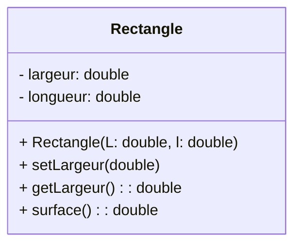

---

## 11. Héritage en UML

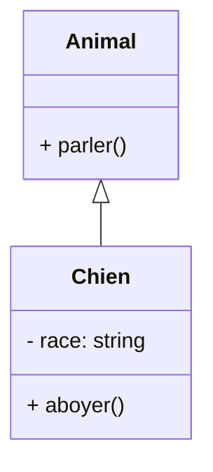

---

## 12. Relations entre classes

### 12.1 Association

Relation simple : un objet **utilise** un autre.

Ex : un étudiant suit un cours.

```cpp
class Cours {};
class Etudiant {
    Cours* coursSuivi; // association
};
```

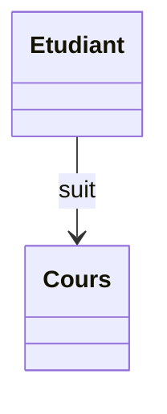

---

### 12.2 Composition (“contient”)

Relation forte « partie-tout » : l’objet enfant **n’existe que grâce au parent**.

Ex : une maison contient des chambres (si la maison disparaît, les chambres aussi).

```cpp
class Moteur {};
class Voiture {
    Moteur moteur;  // composition
};
```

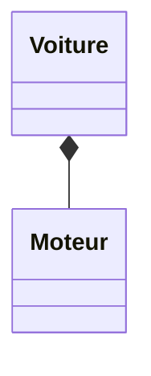

| Critère                    | Association  | Composition    |
| -------------------------- | ------------ | -------------- |
| Intensité                  | Faible       | Forte          |
| Dépendance de durée de vie | Non          | Oui            |
| Notation UML               | Ligne simple | Losange plein  |

---

## 13. Exemple UML détaillé : Rectangle

```
------------------------------------
|            Rectangle             |
------------------------------------
| - longueur : double              |
| - largeur  : double              |
| # objetCount : int (static)      |
------------------------------------
| + Rectangle(L:double, l:double)  |
| + ~Rectangle()                   |
| + surface() : double             |
| + setLargeur(double)             |
| + getLargeur() : double          |
------------------------------------
```

---


## Résumé

| Concept      | Idée simple        |
| ------------ | ------------------ |
| Classe       | Modèle             |
| Objet        | Exemple du modèle  |
| Constructeur | Initialise l’objet |
| private      | Caché              |
| public       | Visible            |
| Héritage     | “est un”           |
| Association  | “utilise”          |
| Composition  | “contient”         |

---

## UML → Code C++

L’objectif :
* comprendre comment **un dessin UML** se traduit en **classe C++**.

---

### 1. Classe simple

#### UML (dessin)

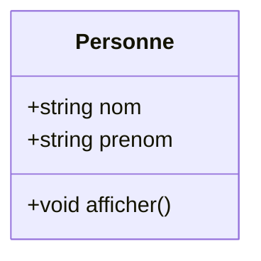

**Ce que ça veut dire :**

* La classe s’appelle *Personne*
* Elle a 2 attributs publics : `nom`, `prenom`
* Elle a 1 méthode : `afficher()`

---

#### Code C++

```cpp
class Personne {
public:
    string nom;
    string prenom;

    void afficher() {
        cout << nom << " " << prenom << endl;
    }
};
```

- **on copie les attributs et les méthodes** depuis le UML.

---

### 2. Héritage

#### UML

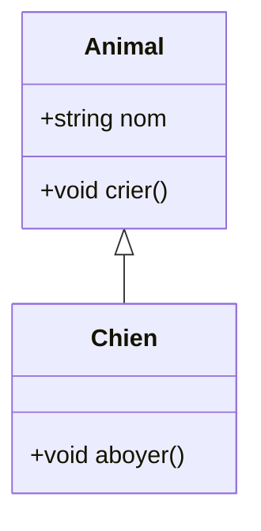

**Signification :**

* Chien **hérite** de Animal
* Il récupère tout ce que Animal possède

---

#### Code C++

```cpp
class Animal {
public:
    string nom;
    void crier() {
        cout << nom << " fait un bruit" << endl;
    }
};

class Chien : public Animal {  // héritage
public:
    void aboyer() {
        cout << nom << " aboie !" << endl;
    }
};
```

- La flèche UML se traduit par `: public Animal`.

---

### 3. Association

#### UML

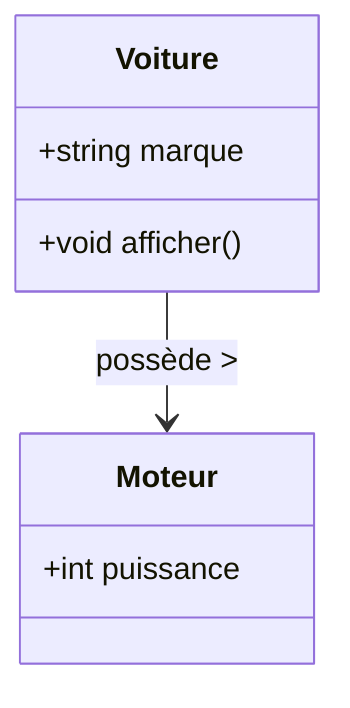

**Signification :**

* La Voiture **connaît** un Moteur
* Ce n’est pas un “enfant”, juste un lien

---

#### Code C++

```cpp
class Voiture {
public:
    string marque;
    Moteur* moteur;   // association = pointeur

    void afficher() {
        cout << marque << " avec moteur " << moteur->puissance << " cv" << endl;
    }
};
```

- Une association = souvent un **pointeur** (`Moteur*`).

---

### 4. Composition

#### UML

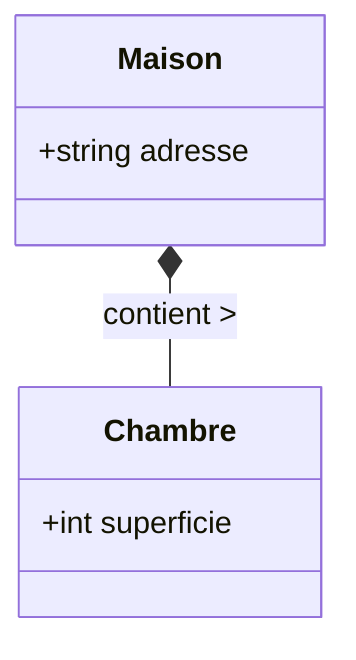

**Signification :**

* Maison **contient directement** une Chambre
* Si la Maison est détruite → la Chambre aussi

---

#### Code C++

```cpp
class Maison {
public:
    string adresse;
    Chambre chambre;   // composition : objet à l’intérieur

    void afficher() {
        cout << "Maison à " << adresse
             << " avec chambre de " << chambre.superficie << " m2" << endl;
    }
};
```

- Composition = **l’objet est inclu dans la classe**, pas un pointeur.

---

### Exercices

#### Exercice 1 – Héritage : Personne → Étudiant / Professeur

##### UML

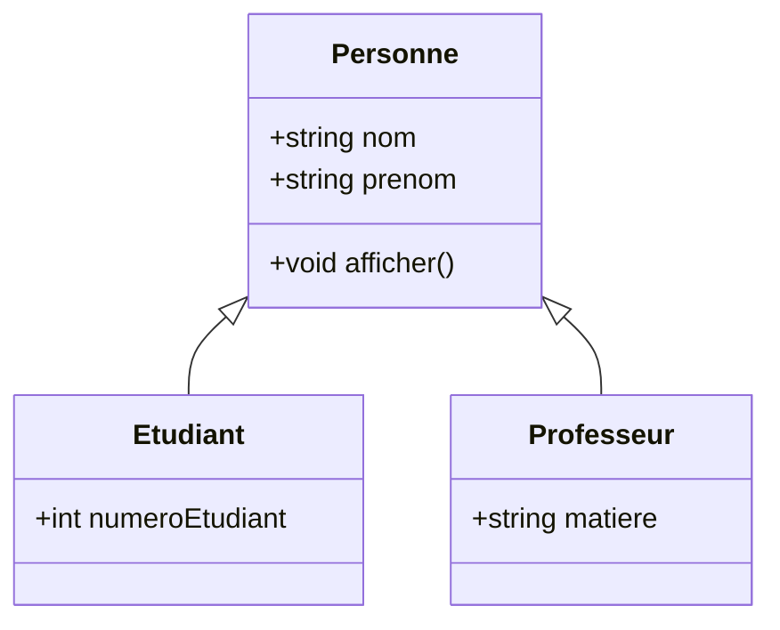

##### Code C++

```cpp
class Personne {
public:
    string nom;
    string prenom;
    void afficher() {
        cout << nom << " " << prenom << endl;
    }
};

class Etudiant : public Personne {
public:
    int numeroEtudiant;
};

class Professeur : public Personne {
public:
    string matiere;
};
```

---

#### Exercice 2 – Voiture / Moteur / Propriétaire

##### UML

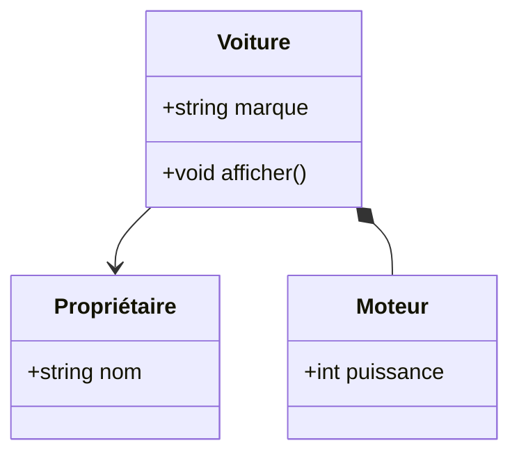

##### Code C++

```cpp
class Voiture {
public:
    string marque;
    Proprietaire* proprio;  // association
    Moteur moteur;          // composition

    void afficher() {
        cout << marque << " de " << proprio->nom
             << " avec moteur " << moteur.puissance << " cv" << endl;
    }
};
```

---

### Résumé

| UML             | C++                              |
| --------------- | -------------------------------- |
| `+`             | `public`                         |
| `-`             | `private`                        |
| Flèche héritage | `class B : public A`             |
| Association     | pointeur vers un objet           |
| Composition     | objet directement dans la classe |

---

## Code → UML

UML sert à **dessiner** ce que le code représente.
On convertit :

* les **attributs** → en liste dans la classe
* les **méthodes** → sous la liste des attributs
* la **visibilité** (`public`, `private`) → `+` ou `-`
* les **relations** (héritage, association, composition)

---

### 1. Classe simple

#### Code C++

```cpp
class Voiture {
public:
    string marque;
    int annee;

    void afficher() {
        cout << marque << " (" << annee << ")";
    }
};
```

#### UML

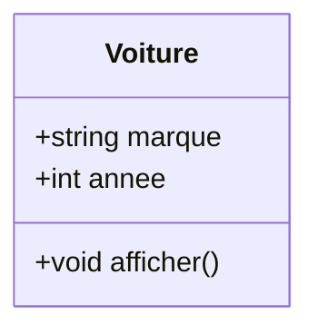

- Public → `+` en UML
- Un attribut = une ligne dans la partie centrale

---

#### Exemple

##### Code

```cpp
class Livre {
    string titre;
    string auteur;
    void afficher();
};
```

##### UML

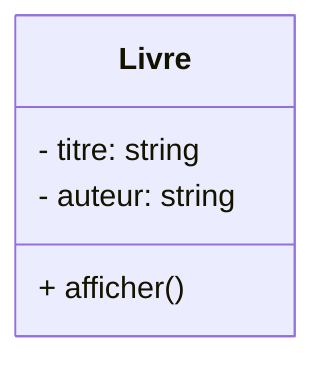

- Private → `-` en UML

---

#### Exercice

##### Code

```cpp
class Personne {
    string nom;
    int age;
    void sePresenter();
};
```

##### UML (solution)

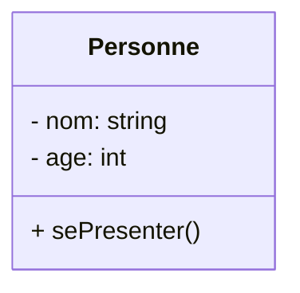

---

### 2. Héritage (relation « est un »)

#### Code C++

```cpp
class Animal {
public:
    string nom;
    void crier() {}
};

class Chat : public Animal {
public:
    void miauler() {}
};
```

#### UML

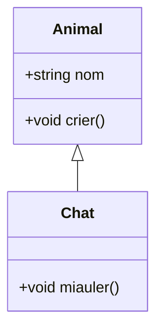

- La flèche `<|--` signifie **hérite de**.

---

#### Exercice (héritage)

##### Code

```cpp
class Employe {
    string nom;
    int id;
};
class Manager : public Employe {
    int equipeSize;
};
```

##### UML (solution)

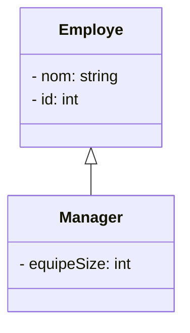

---

### 3. Association (relation simple)

Une association = une classe **connaît** une autre.

#### Code

```cpp
class Moteur {
public:
    int puissance;
};

class Voiture {
public:
    string marque;
    Moteur* moteur; // association
};
```

#### UML

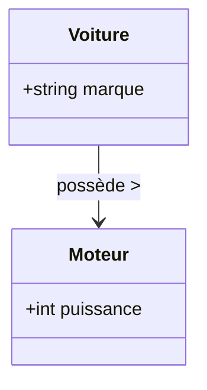

- Une association est souvent un **pointeur**
- Flèche simple : `-->`

---

#### Exercice

##### Code

```cpp
class Client {};
class Commande {};
```

##### UML (solution)

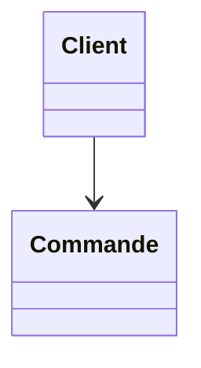

---

### 4. Composition (relation “fait partie de”)

→ L’objet contenu **vit et meurt** avec l’objet parent.

#### Code

```cpp
class Chambre {
public:
    int superficie;
};

class Maison {
public:
    string adresse;
    Chambre chambre; // composition
};
```

#### UML


- Composition = `*--` (losange rempli)

---

#### Exercice

##### Code

```cpp
class Bibliotheque {
    Livre livres[100];
};
```

##### UML (solution)

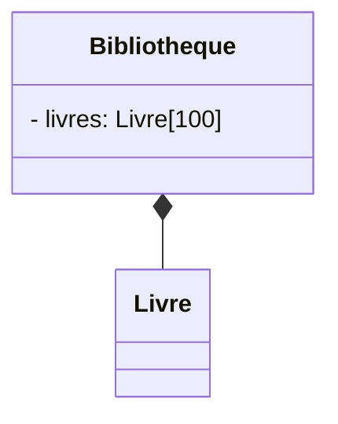

---

### 5. Héritage + Association

#### Code

```cpp
class Personne {
public:
    string nom;
    string prenom;
};

class Etudiant : public Personne {
public:
    int numeroEtudiant;
};

class Classe {
public:
    string nomClasse;
    Etudiant* etudiant; // association
};
```

#### UML

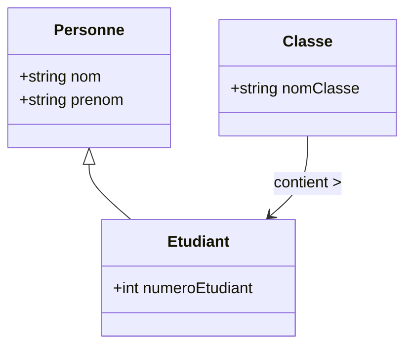

---

## Récapitulatif

| En C++               | En UML            |
| -------------------- | ----------------- |
| `public:`            | `+`               |
| `private:`           | `-`               |
| `class B : public A` | `A <-- B`         |
| `Type* objet;`       | `-->` association |
| `Type objet;`        | `*--` composition |

---
---


## **Résumé – UML ↔ C++**

### *Traduire un diagramme UML en code C++ et inversement*

---

### Visibilités (accès)

| UML | C++         | Signification                                |
| --- | ----------- | -------------------------------------------- |
| `+` | `public`    | Accessible partout                           |
| `-` | `private`   | Accessible seulement dans la classe          |
| `#` | `protected` | Accessible dans la classe + classes dérivées |

---

### Structure d’une classe UML

```
-------------------------
|     NomClasse         |
-------------------------
| + attribut1 : type    |
| - attribut2 : type    |
-------------------------
| + methode1() : type   |
| + methode2(param)     |
-------------------------
```

* **Attributs** → variables dans la classe
* **Méthodes** → fonctions membres

---

### UML → Code C++

#### Attributs

**UML**

```
+ nom : string
- age : int
```

**C++**

```cpp
public:
    string nom;
private:
    int age;
```

---

#### Méthodes

**UML**

```
+ afficher() : void
```

**C++**

```cpp
public:
    void afficher();
```

---

#### Classe complète

**UML**

```mermaid
classDiagram
class Personne {
  +string nom
  -int age
  +void afficher()
}
```

**Code C++**

```cpp
class Personne {
public:
    string nom;
    void afficher();
private:
    int age;
};
```

---

### Code C++ → UML

#### Règles simples

* Attributs avant les méthodes
* Conserver la visibilité
* Ne pas afficher le code interne, juste les signatures
* Noter le type après `:` en UML

---

### Les relations UML et leur code C++

#### A) Héritage (relation “est un”)

**UML**

```
Animal <|-- Chien
```

**C++**

```cpp
class Chien : public Animal {};
```

- **Flèche triangle ouvert côté parent**

---

#### B) Association (relation simple)

- Une classe **utilise / connaît** une autre.
- Souvent un **pointeur** ou **référence**.

**C++**

```cpp
class Voiture {
    Moteur* moteur;
};
```

**UML**

```
Voiture --> Moteur
```

- **Flèche simple `-->`**

---

#### C) Composition (relation “fait partie de / contient”)

* L’objet appartient totalement au parent.
* Se traduit par un **attribut direct** (pas un pointeur).

**C++**

```cpp
class Maison {
    Chambre chambre; // composition
};
```

**UML**

```
Maison *-- Chambre
```

- **Losange noir côté parent**

---

### Résumé des symboles UML

| Relation          | UML   | C++                     |                      |
| ----------------- | ----- | ----------------------- | -------------------- |
| Héritage          | `<    | --`                     | `class B : public A` |
| Association       | `-->` | `Type* obj;`            |                      |
| Composition       | `*--` | `Type obj;`             |                      |
| Agrégation (rare) | `o--` | `Type* obj;` ou `Type&` |                      |
| Public            | `+`   | `public:`               |                      |
| Private           | `-`   | `private:`              |                      |
| Protected         | `#`   | `protected:`            |                      |

---

### Exemples

#### UML → Code

**UML**

```
class Livre {
  - titre : string
  + afficher()
}
```

**C++**

```cpp
class Livre {
private:
    string titre;
public:
    void afficher();
};
```

---

#### Code → UML

**C++**

```cpp
class Etudiant : public Personne {
    int numero;
};
```

**UML**

```
Personne <|-- Etudiant
Etudiant {
  - numero : int
}
```

---

### Checklist (pour réussir UML ↔ C++)

- Identifier les **visibilités**
- Lister les **attributs** puis **méthodes**
- Pour les relations :
    * pointeur → association
    * objet direct → composition
    * `class B : public A` → héritage
      - Noter les types en UML (`nom : type`)
      - Ne pas mettre de code dans UML (juste les signatures)

---


## **Exercices UML ↔ C++**

---

### **Partie 1 — UML → Code C++**

---

#### **Exercice 1 : Classe simple**

##### UML

```mermaid
classDiagram
class Produit {
  +string nom
  +float prix
  +void afficher()
}
```

* **Consigne :** Écrire la classe C++ correspondante.

---

##### **Correction**

```cpp
class Produit {
public:
    string nom;
    float prix;

    void afficher() {
        cout << nom << " : " << prix << "€" << endl;
    }
};
```

---

#### **Exercice 2 : visibilité**

##### UML

```mermaid
classDiagram
class Compte {
  -int numero
  -float solde
  +void deposer(float montant)
}
```

* **Écrire la traduction C++**.

---

##### **Correction**

```cpp
class Compte {
private:
    int numero;
    float solde;

public:
    void deposer(float montant) {
        solde += montant;
    }
};
```

---

#### **Exercice 3 : Héritage**

##### UML

```mermaid
classDiagram
class Animal {
  +string nom
  +void crier()
}
class Chien {
  +void aboyer()
}
Animal <|-- Chien
```

- **Écrire les classes C++**.

---

##### **Correction**

```cpp
class Animal {
public:
    string nom;
    void crier() {
        cout << nom << " fait un bruit" << endl;
    }
};

class Chien : public Animal {
public:
    void aboyer() {
        cout << nom << " aboie !" << endl;
    }
};
```

---

#### **Exercice 4 : Association simple**

##### UML

```mermaid
classDiagram
class Joueur {
  +string pseudo
}

class Arme {
  +string nom
}

Joueur --> Arme : utilise >
```

- Écrire le code C++.

---

##### **Correction**

```cpp
class Arme {
public:
    string nom;
};

class Joueur {
public:
    string pseudo;
    Arme* arme;   // association
};
```

---

#### **Exercice 5 : Composition**

##### UML

```mermaid
classDiagram
class Maison {
  +string adresse
}
class Porte {
  +string couleur
}
Maison *-- Porte
```

- Traduire en C++.

---

##### **Correction**

```cpp
class Porte {
public:
    string couleur;
};

class Maison {
public:
    string adresse;
    Porte porte;   // composition
};
```

---

### **Partie 2 — Code C++ → UML**

---

#### **Exercice 6 : classe simple**

##### Code

```cpp
class Film {
public:
    string titre;
    int annee;
    void afficher();
};
```

- **Dessiner le diagramme UML**.

---

##### **Correction UML**

```mermaid
classDiagram
class Film {
  + titre : string
  + annee : int
  + afficher() : void
}
```

---

#### **Exercice 7 : attributs privés**

##### Code

```cpp
class Banque {
private:
    float capital;
public:
    void afficher();
};
```

---

##### **Correction UML**

```mermaid
classDiagram
class Banque {
  - capital : float
  + afficher() : void
}
```

---

#### **Exercice 8 : Héritage**

##### Code

```cpp
class Vehicule {
public:
    int vitesse;
};

class Moto : public Vehicule {
public:
    int cylindree;
};
```

---

##### **Correction UML**

```mermaid
classDiagram
class Vehicule {
  + vitesse : int
}

class Moto {
  + cylindree : int
}

Vehicule <|-- Moto
```

---

#### **Exercice 9 : Association**

##### Code

```cpp
class Auteur {
public:
    string nom;
};

class Livre {
public:
    string titre;
    Auteur* auteur;
};
```

---

##### **Correction UML**

```mermaid
classDiagram
class Auteur {
  + nom : string
}

class Livre {
  + titre : string
}

Livre --> Auteur
```

---

#### **Exercice 10 : Composition**

##### Code

```cpp
class Ordinateur {
public:
    string marque;
    Processeur cpu;
};

class Processeur {
public:
    int vitesse;
};
```

---

##### **Correction UML**

```mermaid
classDiagram
class Ordinateur {
  + marque : string
}

class Processeur {
  + vitesse : int
}

Ordinateur *-- Processeur
```

---

### **Partie 3 — Mélange !**

---

#### **Exercice 11**

##### Code

```cpp
class Personne {
public:
    string nom;
};

class Etudiant : public Personne {
public:
    int id;
};

class Groupe {
public:
    string nom;
    Etudiant* chef;
};
```

- Faire l’UML.

---

##### **Correction UML**

```mermaid
classDiagram
class Personne {
  + nom : string
}

class Etudiant {
  + id : int
}

class Groupe {
  + nom : string
}

Personne <|-- Etudiant
Groupe --> Etudiant : chef >
```

---

#### **Exercice 12**

##### UML

```mermaid
classDiagram
class Universite {
   +string nom
}
class Faculte {
   +string nom
}
class Professeur {
   +string nom
}

Universite *-- Faculte
Faculte --> Professeur
```

- Écrire le code C++ correspondant.

---

##### **Correction**

```cpp
class Faculte {
public:
    string nom;
};

class Professeur {
public:
    string nom;
};

class Universite {
public:
    string nom;
    Faculte faculte;     // composition
};

class Faculte {
public:
    string nom;
    Professeur* prof;    // association
};
```

---


